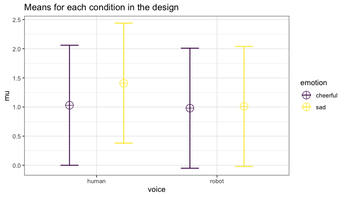
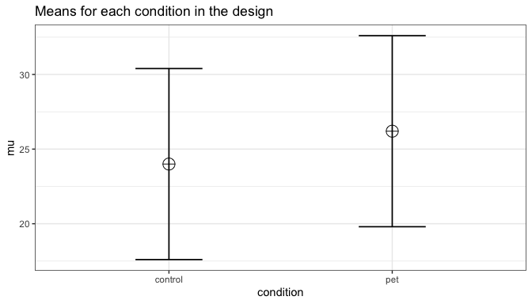
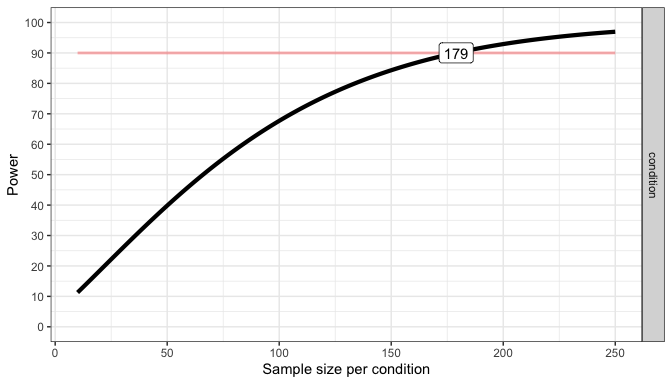
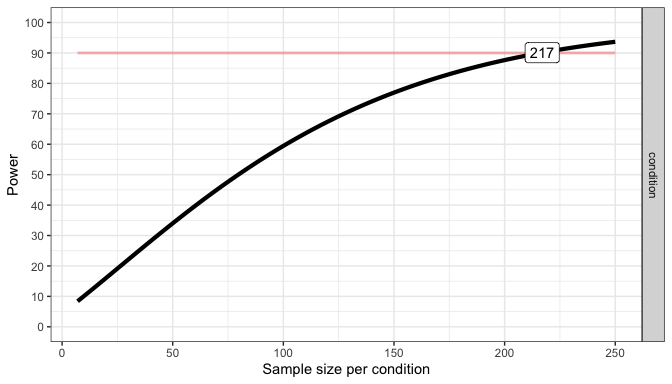

## Table of Contents

  - [ANOVA\_design Function](#anova_design-function)
  - [Simulation-based power
    calculations](#simulation-based-power-calculations)
  - [ANOVA\_power Function](#the-anova_power-function)
  - [ANOVA\_exact Function](#the-anova_exact-function)
      - [Two Group One-Way ANOVA](#power-in-a-two-group-one-way-anova)
      - [The plot\_power function](#the-plot_power-function)
      - [Three Between Subjects
        Conditions](#three-between-subject-conditions)
      - [Repeated Measures ANOVA](#power-in-repeated-measures-anova)
      - [2x2 ANOVA, Within-Between
        Design](#2x2-anova-within-between-design)
      - [Two-Way ANOVA, Between Participants
        Design](#two-way-anova-between-participants-design)
      - [2x2 ANOVA, Within Design](#two-by-two-anova-within-design)

# An Introduction to ANOVApower

The goal of ANOVApower is to easily simulate ANOVA designs and
empirically calculate power using a simulation approach. This app is
intended to be utilized for prospective (a priori) power analysis.

## Installation

You can install the released version of ANOVApower from
[GitHub](https://github.com/Lakens/ANOVApower) with:

``` r
devtools::install_github("Lakens/ANOVApower")
```

## ANOVA\_design function

Currently the ANOVA\_design function can create designs up three
factors, for both within, between, and mixed designs. It requires the
following input: design, n, mu, sd, r, and optionally allows you to set
labelnames.

1.  design: string that specifies the design (see below).
2.  n: the sample size for each between subject condition.
3.  mu: a vector with the means for each condition.
4.  sd: the population standard deviation. Assumes homogeneity of
    variances (only one standard deviation can be provided).
5.  r: the correlation for within designs (or 0 for between designs).
6.  labelnames: This is an optonal vector of words that indicates factor
    names and level names (see below).
7.  A final optional setting is to specify if you want to output a plot
    or not (plot = TRUE or FALSE)

### Specifying the design using ‘design’

‘design’ is used to specify the design. Every factor is specified with a
number, indicating the numner of levels of the factor, and a letter, b
or w, to indicate whether the factor is manipulated between or within
participants. For example, a `2b` design has two between-participant
groups. A `12w` design has one factor with 12 levels, all manipulated
within-participants. A "2b\*3w" is a design with two factors (a 2b
factor and a 3w factor), the first of which has 2 between participant
levels (2b), and the second of which has 3 within participants levels
(3w). **If there are multiple factors (the functions take up to three
different factors) seperate factors with a \* (asterisk)**. An example
of a `2b*3w` design is a group of people in one condition who get a
drug, and a group of people in another condition who get a placebo, and
we measure their health before they take the pill, one day after they
take the pill, and a week after they take the pill.

### Specifying the means using ‘mu’

Note that for each cell in the design, a mean must be provided. Thus,
for a "2b\*3w" design, 6 means need to be entered.

Means need to be entered in the correct order. ANOVA\_design outputs a
plot so you can check if you entered all means as you intended. Always
carefully check if the plot that is generated matches your expectations.

The general principle is that the code generates factors, indicated by
the factor names you entered in the labelnames variable, (i.e.,
*condition* and *time*). Levels are indicated by factor names and levels
(e.g., control\_time1, control\_time2, control\_time3, etc).

If your design has just one factor, just enter the means in the same
order as the labelnames (see below). For more factors, note the general
pattern in the example below. Means are entered in the following order
for a 3 factors design (each with 2 levels):

1.  a1 b1 c1
2.  a1 b1 c2
3.  a1 b2 c1
4.  a1 b2 c2
5.  a2 b1 c1
6.  a2 b1 c2
7.  a2 b2 c1
8.  a2 b2 c2

So if you enter the means 1, 2, 3, 4, 5, 6, 7, 8 the first 4 means
correspond to level 1 of factor 1, the second 4 means correspond to
level 2 of factor 1. Within the first 4 means, the first 2 correspond to
level 1 of factor 2, and within those 2 means, the first corresponds to
level 1 of factor 3.

The plot below visualizes means from 1 to 8 being entered in a vector:
mu = c(1, 2, 3, 4, 5, 6, 7, 8) so you can see how the basic ordering
works.

<!-- -->

### Specifying label names

To make sure the plots and tables with simulation results are easy to
interpret, it really helps to name all factors and levels. You can enter
the labels in the ‘labelnames’ variable. You can also choose not to
specify names. Then all factors are indicated by letters (a, b, c) and
all levels by numbers (a1, a2, a3).

For the 2x3 design we have been using as an example, where there are 2
factors (condition and time of measurement), the first with 2 levels
(placebo vs. medicine) and the second with three levels (time1, time2,
and time3) we would enter the labels as follows:

c(“condition”, “placebo”, “medicine”, “time”, “time1”, “time2”, “time3”)

As you can see, you follow the order of the design (2b\*3w), and first
write the **FACTOR** label (condition) followed by the levels of that
factor (placebo and medicine). Then you write the second factor name
(time) followed by the three labels for each **LEVEL** (time1, time2,
time3). **Do not use spaces in the names (so not “time 1” but “time1” or
“time\_1”).**

Some examples:

1.  One within factor (time with 2 levels), 2w:

<!-- end list -->

  - `c("time", "morning", "evening")`

<!-- end list -->

2.  Two between factors (time and group, each with 2 levels), 2b\*2b:

<!-- end list -->

  - `c("time", "morning", "evening", "group", "control",
    "experimental")`

<!-- end list -->

3.  Two between factors (time and group, first with 4 levels, second
    with 2 levels), 4b\*2b:

<!-- end list -->

  - `c("time", "morning", "afternoon" ,"evening", "night", "group",
    "control", "experimental")`

### Specifying the correlation

Depending on whether factors are manipulated within or between,
variables are correlated, or not. You can set the correlation for
within-participant factors. You can either assume all factors have the
same correlation (e.g., r = 0.7), or enter the correlations for each
pair of observations separately by specifying a correlation matrix.

#### Specifying the correlation matrix.

In a 2x2 within-participant design, with factors A and B, each with 2
levels, there are 6 possible comparisons that can be made.

1.  A1 vs. A2
2.  A1 vs. B1
3.  A1 vs. B2
4.  A2 vs. B1
5.  A2 vs. B2
6.  B1 vs. B2

The number of possible comparisons is the product of the levels of all
factors squared minus the product of all factors, divided by two. For a
2x2 design where each factor has two levels, this is:

``` r
(((2*2)^2)-(2*2))/2
```

    ## [1] 6

The number of possible comparisons increases rapidly when adding factors
and levels for each factor. For example, for a 2x2x4 design it is:

``` r
(((2*2*4)^2)-(2*2*4))/2
```

    ## [1] 120

Each of these comparisons can have their own correlation if the factor
is manipulated within subjects (if the factor is manipulated between
subjects the correlation is 0). These correlations determine the
covariance matrix. Potvin and Schutz (2000) surveyed statistical tools
for power analysis and conclude that most software packages are limited
to one factor repeated measure designs and do not provide power
calculations for within designs with multiple factor (which is still
true for software such as G\*Power). Furthermore, software solutions
which were available at the time (DATASIM by Bradley, Russel, & Reeve,
1996) required researchers to assume correlations were of the same
magnitude for all within factors, which is not always realistic. If you
do not want to assume equal correlations for all paired comparisons, you
can specify the correlation for each possible comparison.

The order in which the correlations are entered in the vector should
match the covariance matrix. The order for a 2x2 design is given in the
6 item list above. The general pattern is that the matrix is filled from
top to bottom, and left to right, illustrated by the increasing
correlations in the table below.

| Factor | a1\_b1 | a1\_b2 | a2\_b1 | a2\_b2 |
| :----- | ------ | ------ | ------ | ------ |
| a1\_b1 | 1.00   | 0.91   | 0.92   | 0.93   |
| a1\_b2 | 0.91   | 1.00   | 0.94   | 0.95   |
| a2\_b1 | 0.92   | 0.94   | 1.00   | 0.96   |
| a2\_b2 | 0.93   | 0.95   | 0.96   | 1.00   |

The diagonal is generated dynamically (and all conditions are perfectly
correlated with themselves).

We would enter this correlation matrix as:

``` r
design_result <- ANOVA_design(design = "2w*2w",
                              n = 80,
                              mu = c(1.1, 1.2, 1.3, 1.4),
                              sd = 2,
                              r <- c(0.91, 0.92, 0.93, 0.94, 0.95, 0.96))
```

<!-- -->

We can check the correlation matrix by asking for it from the
design\_result object to check if it was entered the way we wanted:

``` r
design_result$cor_mat
```

    ##       a1_b1 a1_b2 a2_b1 a2_b2
    ## a1_b1  1.00  0.91  0.92  0.93
    ## a1_b2  0.91  1.00  0.94  0.95
    ## a2_b1  0.92  0.94  1.00  0.96
    ## a2_b2  0.93  0.95  0.96  1.00

Note that we did not specify the labelnames, and thus they are
automatically created.

### Specifying the sample size

You can set the sample size **per condition** by setting a value for
n. The assumption is that you will collect equal sample sizes in all
conditions \[expanding ANOVApower to allow different sample sizes in
each group is a planned future option\].

### Specifying the standard deviation

You can set the standard deviation by setting a value of sd. Currently
ANOVApower only allows you to perform calculations under the assumption
of homogeneity of variances (the standard deviation is the same across
conditions). Note that there is always some uncertainty in which values
you can expect in the study you are planning. It is therefore useful to
perform sensitivity analyses (e.g., running the simulation with the
expected standard deviation, but also with more conservative or even
worst-case-scenario values).

# Simulation-based power calculations

There are two ways to calculate the statistical power of an ANOVA design
based on simulations. The first is to repeatedly simulate data for each
condition based on the means, sample size, standard deviation, and
correlation, under specific statistical assumptions (i.e., normaly
distributed data). The `ANOVA_power` function allows you to perform
power analyses based on repeatedly simulating normaly distributed data.
A second approach is to simulate a dataset that has *exactly* the
desired properties - every cell of the design has n datapoints that have
the desired mean and standard deviation, and correlation between groups
(for a within design). By performing an ANOVA on this dataset, we can
calculate the required statistics from the ANOVA result used to
calculate the statistical power. The `ANOVA_exact` function allows you
to calculate power based on this approach. The `ANOVA_power` function is
a bit more flexible (e.g., we can use different ways to correct for
multiple comparisons, or in future versions of the package allow you to
simulate more realistic datasets that are not normally distributed), but
the `ANOVA_exact` function is much faster (and takes seconds, instead of
minutes or hours for a large number of simulations).

## The ANOVA\_power function

The ANOVA\_power function takes the result from the ANOVA\_design
function, and simulates data nsims times using a specified alpha level.
As output, it provides a table for the ANOVA results, and the results
for all independent comparisons.

It requires the following input: ANOVA\_design, alpha\_level, p\_adjust,
nsims, seed, and verbose.

1.  design\_result: Output from the ANOVA\_design function saved as an
    object
2.  alpha\_level: Alpha level used to determine statistical significance
3.  p\_adjust: Correction for multiple comparisons using the
    [p.adjust](https://www.rdocumentation.org/packages/stats/versions/3.5.3/topics/p.adjust)
    function
4.  nsims: number of simulations to perform
5.  seed: Set seed for reproducible results
6.  verbose: Set to FALSE to not print results (default = TRUE)

Simulations typically take some time. Larger numbers of simulations
yield more accurate results, but also take a long time. We recommend
testing the set up with 100 simulations, and run 1000 if the set-up is
correct (or 10000 if you are getting a coffee, or 100.000 if you are
about accuracy to digits behind the decimal).

## The ANOVA\_exact function

The ANOVA\_exact function takes the result from the ANOVA\_design
function, and simulates one dataset that exactly matches the desired
properties (using the `mvrnorm` function from the `MASS` package, using
the setting `empirical = TRUE`). This dataset is used to perform a
single ANOVA, and the results are used to compute power (thanks to Chris
Aberson for inspiring this approach).

ANOVA\_exact requires the following input: ANOVA\_design, alpha\_level,
and verbose.

1.  design\_result: Output from the ANOVA\_design function saved as an
    object
2.  alpha\_level: Alpha level used to determine statistical significance
3.  verbose: Set to FALSE to not print results (default = TRUE)

Compared to the ANOVA\_power function, the ANOVA\_exact approach is much
faster (it requires simulating only a single dataset). Currently the
only difference is that ANOVA\_exact does not allow you to examine the
consequences of correcting for multiple comparisons (there is no
`p_adjust` option), and that ANOVA\_exact does not work for sample sizes
smaller than 8 (because it is not possible to simulate a dataset with
exactly the desired properties for very small sample sizes).

## An Example

Imagine you plan to perform a study in which participants interact with
an artificial voice assistant that sounds either like a human or like a
robot, and who sounds either cheerful or sad. In the example below, 1000
simulations for a 2\*2 mixed design (first factor, voice, is manipulated
between participants, the second factor, emotion, is manipulated within
participants) are performed. The sample size is 40 in each between
subject condition (so 80 participants in total), the assumed population
standard deviation is 1.03, the correlation for the within factors is
0.8, and the means are 1.03, 1.21, 0.98, 1.01. No correction for
multiple comparisons is applied. The alpha level used as a significance
threshold is set to 0.01 for this simulation.

``` r
design_result <- ANOVA_design(design = "2b*2w",
                   n = 40, 
                   mu = c(1.03, 1.41, 0.98, 1.01), 
                   sd = 1.03, 
                   r=0.8, 
                   labelnames = c("voice", "human", "robot", "emotion", "cheerful", "sad"))
```

<!-- -->

``` r
# power_result_vig_1 <- ANOVA_power(design_result, 
#                                   alpha = 0.05, 
#                                   nsims = nsims, 
#                                   seed = 1234)
# reduce file size for github - only save what is needed
# power_result_vig_1$sim_data <- NULL
# #power_result_vig_1$plot1 <- NULL
# power_result_vig_1$plot2 <- NULL
# saveRDS(power_result_vig_1, file = "vignettes/sim_data/power_result_vig_1_test.rds")
power_result_vig_1 <- readRDS(file = "vignettes/sim_data/power_result_vig_1.rds")
```

The result for the power simulation is printed, and has two sections
(which can be surpressed by setting verbose = FALSE). The first table
provides power (from 0 to 100%) and effect sizes (partial eta-squared)
for the ANOVA result. We see the results for the main effects of factor
voice, emotion, and the voice\*emotion interaction.

The result for the power simulation reveal power is highest for the main
effect of emotion. Remember that this is the within-subjects factor, and
the means are highly correlated (0.8) - so we have high power for within
comparisons. Power is lower for the interaction, and very low for the
main effect of voice.

An ANOVA is typically followed up with contrasts. A statistical
hypothesis often predicts not just an interaction, but also the shape of
an interaction. For example, when looking at the plot of our design
above, we might be specifically interested in comparing the independent
effect for the cheerful vs sad human voice assistant, and the difference
for sad voice when they are robotic or human. The second table provides
the power for *t*-tests for all comparisons, and the effect sizes
(Cohen’s d for between-subject contrasts, and Cohen’s
 for
within-subject contrasts, see
[Lakens, 2013](https://www.frontiersin.org/articles/10.3389/fpsyg.2013.00863/full)).

Power is relatively high for the differences between within-participant
conditions, and power is very low for the minor differences among the
three similar means (1.03, 0.98, 1.01). In addition to the two tables,
the ANOVA\_power function returns the raw simulation data (all
*p*-values and effect sizes for each simulation, see
simulation\_result$sim\_data) and a plot showing the *p*-value
distributions for all tests in the ANOVA.

``` r
power_result_vig_1$plot1
```

<!-- -->

## Power in a Two Group One-Way ANOVA

Imagine we aim to design a study to test the hypothesis that giving
people a pet to take care of will increase their life satisfaction. We
have a control condition, and a condition where people get a pet, and
randomly assign participants to either condition. We can simulate a
One-Way ANOVA with a specified alpha, sample size, and effect size, on
see which statistical power we would have for the ANOVA. We expect pets
to increase life-satisfaction compared to the control condition. Based
on work by Pavot and Diener (1993) we believe that we can expect
responses on the life-satifaction scale to have a mean of approximately
24 in our population, with a standard deviation of 6.4. We expect having
a pet increases life satisfaction with approximately 2.2 scale points
for participants who get a pet. We plan to collect data from 200
participants in total, with 100 participants in each condition. We
examine the statistical power our design would have to detect the
differences we predict.

``` r
design <- "2b"
n <- 100
mu <- c(24, 26.2)
sd <- 6.4
labelnames <- c("condition", "control", "pet") #

design_result <- ANOVA_design(design = design,
                              n = n,
                              mu = mu, 
                              sd = sd, 
                              labelnames = labelnames)
```

<!-- -->

``` r
# power_result_vig_2 <- ANOVA_power(design_result, nsims = nsims, seed = 1234)
# 
# reduce file size for github - only save what is needed
# power_result_vig_2$sim_data <- NULL
# power_result_vig_2$plot1 <- NULL
# power_result_vig_2$plot2 <- NULL
# saveRDS(power_result_vig_2, file = "vignettes/sim_data/power_result_vig_2.rds")
power_result_vig_2 <- readRDS(file = "vignettes/sim_data/power_result_vig_2.rds")

#Note we do not specify any correlation in the ANOVA_design function (default r = 0), nor do we specify an alpha in the ANOVA_power function (default is 0.05)
```

The result shows that we have exactly the same power for the ANOVA, as
we have for the *t*-test. This is because when there are only two
groups, these tests are mathematically identical. In a study with 100
participants per condition, we would have quite low power (around
67.7%). An ANOVA with 2 groups is identical to a *t*-test. For our
example, Cohen’s d (the standardized mean difference) is 2.2/6.4, or d =
0.34375 for the difference between the control condition and having
pets, which we can use to easily compute the expected power for these
simple comparisons using the pwr package.

``` r
library(pwr)
pwr.t.test(d = 2.2/6.4,
           n = 100,
           sig.level = 0.05,
           type="two.sample",
           alternative="two.sided")$power
```

    ## [1] 0.6768572

We can also directly compute Cohen’s f from Cohen’s d for two groups, as
Cohen (1988) describes, because f =
. So f = 0.5\*0.34375 = 0.171875. And indeed, power
analysis using the pwr package yields the same result using the
pwr.anova.test as the power.t.test.

``` r
pwr.anova.test(n = 100,
               k = 2,
               f = 0.171875,
               sig.level = 0.05)$power
```

    ## [1] 0.6768572

This analysis tells us that running the study with 100 participants in
each condition is quite likely to *not* yield a significant test result,
even if our expected pattern of differences is true. This is clearly not
optimal. If we perform a study, we would like to get informative
results, which means we should be likely to detect effect we expect or
care about, if these effects exist, and not find effects, if they are
absent.

How many participants do we need for sufficient power? Given the
expected difference and standard deviation, d = 0.34375, and f =
0.171875, we can increase the number of participants and run the
simulation until we are content. The desired power depends on the cost
of a Type 2 error. Cohen recommended to aim for 80% power, or a Type 2
error rate of 20%. I personally find a 20% Type 2 error rate too high,
and not balanced enough compared to a much stricter Type 1 error rate
(often by default 5%, although you should justify your alpha, for
example by [reducing it as a function of the sample
size](http://daniellakens.blogspot.com/2018/12/testing-whether-observed-data-should.html),
or by [balancing error
rates](http://daniellakens.blogspot.com/2019/05/justifying-your-alpha-by-minimizing-or.html)).
Let’s say we want to aim for 90% power.

Especially when you are increasing the sample size in your design to
figure out how many participants you would need, it is much more
efficient to use the `ANOVA_exact` function. You can see in the code
below that we slowly increase the sample size and find that 180
participants give a bit more than 90% power.

``` r
design_result <- ANOVA_design(design = "2b",
                   n = 100, 
                   mu = c(24, 26.2), 
                   sd = 6.4, 
                   labelnames = c("condition", "control", "pet"))
```

<!-- -->

``` r
ANOVA_exact(design_result)$main_results$power
```

    ## Power and Effect sizes for ANOVA tests
    ##           power partial_eta_squared cohen_f non_centrality
    ## condition 67.69               0.029  0.1727         5.9082
    ## 
    ## Power and Effect sizes for contrasts
    ##                                   power effect_size
    ## p_condition_control_condition_pet 67.69      0.3437

    ## [1] 67.69

``` r
# power of 67.7 is a bit low. Let's increase it a bit to n = 150 to see if we are closer to our goal of 90% power.

design_result <- ANOVA_design(design = "2b",
                   n = 150, 
                   mu = c(24, 26.2), 
                   sd = 6.4, 
                   labelnames = c("condition", "control", "pet"),
                   plot = FALSE)

ANOVA_exact(design_result)$main_results$power
```

    ## Power and Effect sizes for ANOVA tests
    ##           power partial_eta_squared cohen_f non_centrality
    ## condition 84.31              0.0289  0.1725         8.8623
    ## 
    ## Power and Effect sizes for contrasts
    ##                                   power effect_size
    ## p_condition_control_condition_pet 84.31      0.3437

    ## [1] 84.31

``` r
# Close, but not there yet. Let's try n = 175 

design_result <- ANOVA_design(design = "2b",
                   n = 175, 
                   mu = c(24, 26.2), 
                   sd = 6.4, 
                   labelnames = c("condition", "control", "pet"),
                   plot = FALSE)

ANOVA_exact(design_result)$main_results$power
```

    ## Power and Effect sizes for ANOVA tests
    ##           power partial_eta_squared cohen_f non_centrality
    ## condition 89.37              0.0289  0.1724        10.3394
    ## 
    ## Power and Effect sizes for contrasts
    ##                                   power effect_size
    ## p_condition_control_condition_pet 89.37      0.3437

    ## [1] 89.37

``` r
#Very close. Let's add a few more and try n = 180

design_result <- ANOVA_design(design = "2b",
                   n = 180, 
                   mu = c(24, 26.2), 
                   sd = 6.4, 
                   labelnames = c("condition", "control", "pet"),
                   plot = FALSE)

ANOVA_exact(design_result)$main_results$power
```

    ## Power and Effect sizes for ANOVA tests
    ##           power partial_eta_squared cohen_f non_centrality
    ## condition 90.19              0.0288  0.1724        10.6348
    ## 
    ## Power and Effect sizes for contrasts
    ##                                   power effect_size
    ## p_condition_control_condition_pet 90.19      0.3437

    ## [1] 90.19

## The plot\_power function

Simulation based power analyses require you to increase to sample size
until power is high enough to reach your desired Type 2 error rate. To
facilitate this trial and error process you can use the `plot_power`
function to plot the power across a range of sample sizes to produce a
power curve.

plot\_power requires the following input: ANOVA\_design, max\_n, and
plot.

1.  design\_result: Output from the ANOVA\_design function saved as an
    object
2.  min\_n: The minimum sample size you want to plot in the power curve
3.  max\_n: The maximum sample size you want to plot in the power curve
4.  plot: Set to FALSE to not print the plot (default = TRUE)

The `plot_power` functions simulates power up to a sample size of
`max_n` using the `ANOVA_exact` function. ALthough it is relatively
fast, with large sample size to can take some time to produce. In the
figure below we can easily see that, assuming the true pattern of means
and standard deviations represents our expected pattern of means and
standard deviations, we have 80% power around 135 participants per
condition, 90% power around 180 participants per condition, and 95%
power around 225 participants per condition.

``` r
plot_power(design_result, min_n = 10, max_n = 250)
```

<!-- -->

Because the true pattern of means is always unknown, it is sensible to
examine the power across a range of scenarios. For example, is the
difference in means is somewhat smaller,because the means are 24 and 26
instead of 24 and 26.2, we can compare the power curve above with the
power curve for a slightly less optimistic scenario (where the true
effect size is slightly smaller).

``` r
design_result <- ANOVA_design(design = "2b",
                   n = 180, 
                   mu = c(24, 26), 
                   sd = 6.4, 
                   labelnames = c("condition", "control", "pet"),
                   plot = FALSE)

plot_power(design_result, max_n = 250)
```

<!-- -->

It could be that in ddition to a slightly smaller effect size, the
standard deviation is slighty larger than we expected as well. This will
reduce the power even further, and is thus an even less optimistic
scenario. Let’s assume the true standard deviation is 6.8 instead of
6.4.

``` r
design_result <- ANOVA_design(design = "2b",
                   n = 180, 
                   mu = c(24, 26), 
                   sd = 6.8, 
                   labelnames = c("condition", "control", "pet"),
                   plot = FALSE)

plot_power(design_result, min_n = 10, max_n = 250)
```

<!-- -->

As these different plots make clear, your study never realy has a known
statistical power. Because the true effect size (i.e., the pattern of
means and standard deviations) is unknown, the true power of your study
is unknown. A study has 90% power *assuming a specific effect size*, but
if the effect size is different than what you expected, the true power
can be either higher or lower. We should therefore always talk about the
‘expected’ power when we do an a-priori power analysis, and provide a
good justification for our expectations (i.e., for the pattern of means,
standard deviations, and correlations for within designs).

## Three between subject conditions

Imagine we aim to design a study to test the hypothesis that giving
people a pet to take care of will increase their life satisfaction. We
have a control condition, a ‘cat’ pet condition, and a ‘dog’ pet
condition. We can simulate a One-Way ANOVA with a specified alpha,
sample size, and effect size, and see the statistical power we would
have for the ANOVA and the follow-up comparisons. We expect all pets to
increase life-satisfaction compared to the control condition. Obviously,
we also expect the people who are in the ‘dog’ pet condition to have
even greater life-satisfaction than people in the ‘cat’ pet condition.
Based on work by Pavot and Diener (1993) we again assume that we can
expect responses on the life-satisfaction scale to have a mean of
approximately 24 in our population, with a standard deviation of 6.4. We
expect having a pet increases life satisfaction with approximately 2.2
scale points for participants who get a cat, and 2.6 scale points for
participants who get a dog. We initially consider collecting data from
150 participants in total, with 50 participants in each condition. But
before we proceed with the data collection, we examine the statistical
power our design would have to detect the differences we predict.

``` r
design <- "3b"
n <- 50
mu <- c(24, 26.2, 26.6)
sd <- 6.4
labelnames <- c("condition", "control", "cat", "dog") #

design_result <- ANOVA_design(design = design,
                   n = n, 
                   mu = mu, 
                   sd = sd, 
                   labelnames = labelnames)
```

<!-- -->

``` r
ANOVA_exact(design_result)
```

    ## Power and Effect sizes for ANOVA tests
    ##           power partial_eta_squared cohen_f non_centrality
    ## condition 47.69              0.0315  0.1804         4.7852
    ## 
    ## Power and Effect sizes for contrasts
    ##                                   power effect_size
    ## p_condition_control_condition_cat 39.83      0.3437
    ## p_condition_control_condition_dog 52.05      0.4063
    ## p_condition_cat_condition_dog      6.10      0.0625

The result shows that you would have quite low power with 50
participants, both for the overall ANOVA (just below 50% power), as for
the follow up comparisons (approximately 40% power for the control vs
cat condition, just above 50% for the control vs dogs condition, and a
really low power (around 6%, just above the Type 1 error rate of 5%) for
the expected difference between cats and dogs. We can easily confirm the
expected power for these simple comparisons using the pwr package. For
our example, Cohen’s d (the standardized mean difference) is 2.2/6.4, or
d = 0.34375 for the difference between the control condition and cats,
2.6/6.4 of d = 0.40625 for the difference between the control condition
and dogs, and 0.4/6.4 or d = 0.0625 for the difference between cats and
dogs as pets.

``` r
pwr.t.test(d = 2.2/6.4,
           n = 50,
           sig.level = 0.05,
           type="two.sample",
           alternative="two.sided")$power
```

    ## [1] 0.3983064

``` r
pwr.t.test(d = 2.6/6.4,
           n = 50,
           sig.level = 0.05,
           type="two.sample",
           alternative="two.sided")$power
```

    ## [1] 0.5205162

``` r
pwr.t.test(d = 0.4/6.4,
           n = 50,
           sig.level = 0.05,
           type="two.sample",
           alternative="two.sided")$power
```

    ## [1] 0.06104044

It is clear we would need to collect more participants in each group to
increase our power. Let’s plot a power curve across a range of sample
sizes to see how much we need to increase the sample size.

``` r
plot_power(design_result, min_n = 10, max_n = 250)
```

<!-- -->

We see 134 participants give us aroud 90% power for the ANOVA. But we
should also check the power for the comparison of the control condition
and the cat condition.

``` r
design <- "3b"
n <- 134
mu <- c(24, 26.2, 26.6)
sd <- 6.4
labelnames <- c("condition", "control", "cat", "dog") #

design_result <- ANOVA_design(design = design,
                   n = n, 
                   mu = mu, 
                   sd = sd, 
                   labelnames = labelnames,
                   plot = FALSE) #do not print the plot (same as above)

ANOVA_exact(design_result)
```

    ## Power and Effect sizes for ANOVA tests
    ##           power partial_eta_squared cohen_f non_centrality
    ## condition 90.18              0.0311  0.1793        12.8242
    ## 
    ## Power and Effect sizes for contrasts
    ##                                   power effect_size
    ## p_condition_control_condition_cat 80.05      0.3437
    ## p_condition_control_condition_dog 91.20      0.4063
    ## p_condition_cat_condition_dog      8.03      0.0625

``` r
n <- 180
design_result <- ANOVA_design(design = design,
                   n = n, 
                   mu = mu, 
                   sd = sd, 
                   labelnames = labelnames,
                   plot = FALSE) #do not print the plot (same as above)

ANOVA_exact(design_result)
```

    ## Power and Effect sizes for ANOVA tests
    ##           power partial_eta_squared cohen_f non_centrality
    ## condition 96.78              0.0311  0.1791        17.2266
    ## 
    ## Power and Effect sizes for contrasts
    ##                                   power effect_size
    ## p_condition_control_condition_cat 90.19      0.3437
    ## p_condition_control_condition_dog 97.02      0.4063
    ## p_condition_cat_condition_dog      9.09      0.0625

``` r
n <- 5380
design_result <- ANOVA_design(design = design,
                   n = n, 
                   mu = mu, 
                   sd = sd, 
                   labelnames = labelnames,
                   plot = FALSE) #do not print the plot (same as above)

ANOVA_exact(design_result)
```

    ## Power and Effect sizes for ANOVA tests
    ##           power partial_eta_squared cohen_f non_centrality
    ## condition   100              0.0309  0.1786       514.8828
    ## 
    ## Power and Effect sizes for contrasts
    ##                                   power effect_size
    ## p_condition_control_condition_cat   100      0.3437
    ## p_condition_control_condition_dog   100      0.4063
    ## p_condition_cat_condition_dog        90      0.0625

With 134 participants per condition, power for this simple comparison is
only 80%. If we want to aim for 90% power for follow up tests, we need
more participants. 180 participants provides good power for the
follow-up comparison between control and cats. But power for the
difference between cats and dogs is incredibly low. We would need 5380
participants to have 90% power for that comparison. This is possible if
you can easily collect data, but might make this specific question
impossible to reliably answer if data collection is costly. Realizing
you can not reliably study a question is an important aspect of a-priori
power analysis.

## Power in Repeated Measures ANOVA

In a repeated measures design multiple observations are collected from
the same participants. In the simplest case, where there are two
repeated observations, a repeated measures ANOVA equals a dependent or
paired *t*-test. Let’s explore the impact of this correlation on the
power of a repeated measures ANOVA.

### Two within conditions

To illustrate the effect of correlated observations, we start by
simulating data for a medium effect size for a dependent (or paired, or
within-subject) *t*-test. Let’s first look at G\*power. If we want to
perform an a-priori power analysis, we are asked to fill in the effect
size . As Cohen
(1988) writes, “The Z subscript is used to emphasize the fact that our
raw score unit is no longer X or Y, but Z”, where Z are the difference
scores of X-Y.


Within designs can have greater power to detect differences than between
designs because the values are correlated, and a within design requires
less participants because each participant provides multiple
observations. One difference between an independent *t*-test and a
dependent *t*-test is that an independent *t*-test has 2(n-1) degrees of
freedom, while a dependent *t*-test has (n-1) degrees of freedom. The
sample size needed in a two-group within-design (NW) relative to the
sample needed in two-group between-designs (NB), assuming normal
distributions, and ignoring the difference in degrees of freedom between
the two types of tests, is (from Maxwell & Delaney, 2004, p. 561,
formula 45):

}{2}")

The division by 2 in the equation is due to the fact that in a
two-condition within design every participant provides two data-points.
The extent to which this reduces the sample size compared to a
between-subject design depends on the correlation (*r*) between the two
dependent variables, as indicated by the 1-r part of the equation. If
the correlation is 0, a within-subject design needs half as many
participants as a between-subject design (e.g., 64 instead 128
participants), simply because every participants provides 2 datapoints.
The higher the correlation, the larger the relative benefit of within
designs, and whenever the correlation is negative (up to -1) the
relative benefit disappears.

Whereas in an independent *t*-test the two observations are
uncorrelated, in a within design the observations are correlated. This
has an effect on the standard deviation of the difference scores. In
turn, because the standardized effect size is the mean difference
divided by the standard deviation of the difference scores, the
correlation has an effect on the standardized mean difference in a
within design, Cohen’s . The relation, as Cohen (1988, formula 2.3.7) explains, is:

}")

Therefore, the relation between dz and d is
}"). As Cohen (1988) writes: "In other words, a given
difference between population means for matched (dependent) samples is
standardized by a value which is
}") as large as would be the case were they
independent. If we enter a correlation of 0.5 in the formula, we get
}=1"). When the correlation is 0.5, d =
. When there is a
strong correlation between dependent variables, for example r = 0.9, we
get
}"), and a
 of 1 would be a
d = 0.45. Reversely,
}}"), so with a r = 0.9, a d of 1 would be
a  = 2.24. Some
consider this increase in
 compared to d
when observations are strongly correlated an ‘inflation’ when estimating
effect sizes, but since the reduction in the standard deviation of the
difference scores due to the correlation makes it easier to distinguish
signal from noise in a hypothesis test, it leads to a clear power
benefit.

There is no equivalent  for Cohen’s f for a within subject ANOVA. For two groups, we can
directly compute Cohen’s f from Cohen’s d, as Cohen (1988) describes,
because f =
. For a d = 0.5, f = 0.25. In G\*power we can run a 2
group within-subject power analysis for ANOVA. We plan for 80% power,
and reproduce the anaysis above for the dependent *t*-test. This works
because the correlation is set to 0.5, when d =
, and thus the
transformation of
f= works.


If we change the correlation to 0.7 and keep all other settings the
same, the repeated measure a-priori power analysis yields a sample of
21. The correlation increases the power for the test.


To reproduce this analysis in G\*power with a dependent *t*-test we need
to change 
following the formula above,
}}"), which yields
 = 0.6454972. If
we enter this value in G\*power for an a-priori power analysis, we get
the exact same results (as we should, since an repeated measures ANOVA
with 2 groups equals a dependent *t*-test). This example illustrates
that the correlation between dependent variables always factors into a
power analysis, both for a dependent *t*-test, and for a repeated
measures ANOVA. Because a dependent *t*-test uses
 the correlation
might be less visible, but given the relation between d and
, the correlation
is always taken into account and can greatly improve power for within
designs compared to between designs.


We can perform both these power analyses using simulations as well. We
set groups to 2 for the simulation, n = 34 (which should give 80.777
power, according to g\*power), a correlation among repeated measures of
0.5, and an alpha of 0.05. In this case, we simulate data with means
-0.25 and 0.25, and set the sd to 1. This means we have a mean
difference of 0.5, and a Cohen’s d of 0.5/1 = 0.5. In the first example,
we set the correlation to 0.5, and the result should be 80.777% power,
and an effect size estimate of 0.5 for the simple effect. We also
calculate partial eta-squared for the ANOVA, which equals
, or 0.05882353.

``` r
K <- 2
n <- 34
sd <- 1
r <- 0.5
alpha = 0.05
f <- 0.25
f2 <- f^2
ES <- f2/(f2+1)
ES
```

    ## [1] 0.05882353

``` r
mu <- mu_from_ES(K = K, ES = ES)
design = paste(K,"w",sep="")
labelnames <- c("speed", "fast", "slow")

design_result <- ANOVA_design(design = design,
                              n = n, 
                              mu = mu, 
                              sd = sd, 
                              r = r, 
                              labelnames = labelnames)
```

<!-- -->

``` r
ANOVA_exact(design_result)
```

    ## Power and Effect sizes for ANOVA tests
    ##       power partial_eta_squared cohen_f non_centrality
    ## speed 80.78              0.2048  0.5075            8.5
    ## 
    ## Power and Effect sizes for contrasts
    ##                         power effect_size
    ## p_speed_fast_speed_slow 80.78         0.5

The results of the exact simulation approach are indeed to 80.777%. Note
that the simulation calculates Cohen’s
 effect sizes for
paired comparisons - which here given the correlation of 0.5 is also 0.5
for a medium effect size.

We should see a larger  if we increase the correlation, keeping the sample size the same,
following the example in Gpower above. We repeat the simulation, and the
only difference is a correlation between dependent variables of 0.7.
This should yield an effect size
 = 0.6454972.

``` r
K <- 2
n <- 34
sd <- 1
r <- 0.7
alpha = 0.05
f <- 0.25
f2 <- f^2
ES <- f2/(f2+1)
ES
```

    ## [1] 0.05882353

``` r
mu <- mu_from_ES(K = K, ES = ES)
design = paste(K,"w",sep="")
labelnames <- c("speed", "fast", "slow")

design_result <- ANOVA_design(design = design,
                              n = n, 
                              mu = mu, 
                              sd = sd, 
                              r = r, 
                              labelnames = labelnames)
```

<!-- -->

``` r
ANOVA_exact(design_result)
```

    ## Power and Effect sizes for ANOVA tests
    ##       power partial_eta_squared cohen_f non_centrality
    ## speed 95.47              0.3004  0.6552        14.1667
    ## 
    ## Power and Effect sizes for contrasts
    ##                         power effect_size
    ## p_speed_fast_speed_slow 95.47      0.6455

### Power in Repeated Measures ANOVA with More than 2 Groups

We will examine a repeated measures experiment with 3 within-participant
conditions, to illustrate how a repeated measures ANOVA extends a
dependent *t*-test. In the example for a two-group within design we
provided a specific formula for the sample size benefit for two groups.
The sample size needed in within-designs (NW) with more than 2
conditions, relative to the sample needed in between-designs (NB),
assuming normal distributions and compound symmetry, and ignoring the
difference in degrees of freedom between the two types of tests, is
(from Maxwell & Delaney, 2004, p. 562, formula 47):

}{a}")

Where a is the number of within-subject levels.

### The relation between Cohen’s f and Cohen’s d

Whereas in the case of a repeated measures ANOVA with 2 groups we could
explain the principles of a power analysis by comparing our test against
a *t*-test and Cohen’s d, this becomes more difficult when we have more
than 2 groups. It is more useful to explain how to directly calculate
Cohen’s f, the effect size used in power analyses for ANOVA. Cohen’s f
is calculated following Cohen, 1988, formula 8.2.1 and 8.2.2:

^2)}N}\\sigma}")

Imagine we have a within-subject experiment with 3 conditions. We ask
people what they mood is when their alarm clock wakes them up, when they
wake up naturally on a week day, and when they wake up naturally on a
weekend day. Based on pilot data, we expect the means (on a 7 point
validated mood scale) are 3.8, 4.2, and 4.3. The standard deviation is
0.9, and the correlation between the dependent measurements is 0.7. We
can calculate Cohen’s f for the ANOVA, and Cohen’s dz for the contrasts:

``` r
mu <- c(3.8, 4.2, 4.3)
sd <- 0.9
f <- sqrt(sum((mu-mean(mu))^2)/length(mu))/sd #Cohen, 1988, formula 8.2.1 and 8.2.2
f
```

    ## [1] 0.2400274

``` r
r <- 0.7
(4.2-3.8)/0.9/sqrt(2*(1-r))
```

    ## [1] 0.5737753

``` r
(4.3-3.8)/0.9/sqrt(2*(1-r))
```

    ## [1] 0.7172191

``` r
(4.3-4.2)/0.9/sqrt(2*(1-r))
```

    ## [1] 0.1434438

The relation between Cohen’s d or dz and Cohen’s f becomes more
difficult when there are multiple groups, because the relationship
depends on the pattern of the means. Cohen (1988) presents calculations
for three patterns, minimal variability (for example, for 5 means:
-0.25, 0, 0, 0, 0.25), medium variability (for example, for 5 means:
-0.25, -0.25, 0.25, 0.25, 0.25 or -0.25, -0.25, -0.25, 0.25, 0.25). For
these three patterns, formula’s are available that compute Cohen’s f
from Cohen’s d, where d is the effect size calculated for the difference
between the largest and smallest mean (if the largest mean is 0.25 and
the smallest mean is -0.25, 0.25 - -0.25 = 0.5, so d is 0.5 divided by
the standard deviation of 0.9). In our example, d would be (4.3-3.8)/0.9
= 0.5555556. If we divide this value by sqrt(2\*(1-r)) we have dz =
0.5555556/0.7745967 = 0.7172191. If the means and standard deviation is
known, it is best to calculate Cohen’s f directly from these values.

We can perform power analyses for within designs using simulations. We
set groups to 3 for the simulation, n = 20, and the correlation between
dependent variables to 0.8. If the true effect size is f = 0.25, and the
alpha level is 0.05, the power is 96.9%.

In this case, we simulate data with means -0.3061862, 0.0000000, and
0.3061862, and set the sd to 1.

``` r
K <- 3
n <- 20
sd <- 1
r <- 0.8
alpha = 0.05
f <- 0.25
f2 <- f^2
ES <- f2/(f2+1)
ES
```

    ## [1] 0.05882353

``` r
mu <- mu_from_ES(K = K, ES = ES)
sqrt(sum((mu-mean(mu))^2)/length(mu))/sd #Cohen, 1988, formula 8.2.1 and 8.2.2
```

    ## [1] 0.25

``` r
design = paste(K,"w",sep="")
labelnames <- c("speed", "fast", "medium", "slow")

design_result <- ANOVA_design(design = design,
                              n = n, 
                              mu = mu, 
                              sd = sd, 
                              r = r, 
                              labelnames = labelnames)
```

<!-- -->

``` r
# power_result_vig_3 <- ANOVA_power(design_result, nsims = nsims)
# reduce file size for github - only save what is needed
# power_result_vig_3$sim_data <- NULL
# power_result_vig_3$plot1 <- NULL
# power_result_vig_3$plot2 <- NULL
# saveRDS(power_result_vig_3, file = "vignettes/sim_data/power_result_vig_3.rds")
power_result_vig_3 <- readRDS(file = "vignettes/sim_data/power_result_vig_3.rds")
```

The results of the simulation are indeed very close to 96.9%. We can see
this is in line with the power estimate from Gpower:


We can even check the calculation of Cohen’s f SPSS style in GPower. We
take the GPower settings as illustrated above. We click the ‘Options’
button, and check the radio button next to ‘As in SPSS’. Click ok, and
you will notice that the ‘Corr among rep measures’ field has
disappeared. The correlation does not need to be entered separately, but
is incorporated in Cohen’s f. The value of Cohen’s f, which was 0.25,
has changed into 0.7024394. This is the SPSS equivalent. The value is
much larger. This value, and it’s corresponding partial eta-squared,
incorporate the correlation between observations.


## 2x2 ANOVA, within-between design

We can simulate a two-way ANOVA with a specific alpha, sample size and
effect size, to achieve a specified statistical power. We will try to
reproduce the power analysis in G\*power for an *F*-test, ANOVA:
Repeated measures, within-between interaction.


For the 2-way interaction, the result should be a power of 91.25% if we
have a total sample size of 46. Since we have 2 levels for the
between-participants factor, that means the number of groups 2 (and both
these groups collect 2 repeated measures).

``` r
mu <- c(-0.25, 0.25, 0.25, -0.25)
n <- 23
sd <- 1
r <- 0.5
design = "2w*2b"
design_result <- ANOVA_design(design = design,
                              n = n, 
                              mu = mu, 
                              sd = sd, 
                              r = r)
```

<!-- -->

``` r
ANOVA_exact(design_result)
```

    ## Power and Effect sizes for ANOVA tests
    ##     power partial_eta_squared cohen_f non_centrality
    ## b    5.00              0.0000  0.0000            0.0
    ## a    5.00              0.0000  0.0000            0.0
    ## b:a 91.25              0.2072  0.5112           11.5
    ## 
    ## Power and Effect sizes for contrasts
    ##                       power effect_size
    ## p_a_a1_b_b1_a_a1_b_b2 38.17         0.5
    ## p_a_a1_b_b1_a_a2_b_b1 63.02         0.5
    ## p_a_a1_b_b1_a_a2_b_b2  5.00         0.0
    ## p_a_a1_b_b2_a_a2_b_b1  5.00         0.0
    ## p_a_a1_b_b2_a_a2_b_b2 63.02        -0.5
    ## p_a_a2_b_b1_a_a2_b_b2 38.17        -0.5

We can simulate the same Two-Way ANOVA increasing the correlation to
0.7. Power should be 98.98% for the two-way interaction.


``` r
mu <- c(-0.25, 0.25, 0.25, -0.25)
n <- 23
sd <- 1
r <- 0.7
design = "2w*2b"
design_result <- ANOVA_design(design = design,
                              n = n, 
                              mu = mu, 
                              sd = sd, 
                              r = r)
```

<!-- -->

``` r
ANOVA_exact(design_result)
```

    ## Power and Effect sizes for ANOVA tests
    ##     power partial_eta_squared cohen_f non_centrality
    ## b    5.00              0.0000    0.00         0.0000
    ## a    5.00              0.0000    0.00         0.0000
    ## b:a 98.98              0.3034    0.66        19.1667
    ## 
    ## Power and Effect sizes for contrasts
    ##                       power effect_size
    ## p_a_a1_b_b1_a_a1_b_b2 38.17      0.5000
    ## p_a_a1_b_b1_a_a2_b_b1 84.09      0.6455
    ## p_a_a1_b_b1_a_a2_b_b2  5.00      0.0000
    ## p_a_a1_b_b2_a_a2_b_b1  5.00      0.0000
    ## p_a_a1_b_b2_a_a2_b_b2 84.09     -0.6455
    ## p_a_a2_b_b1_a_a2_b_b2 38.17     -0.5000

## Two-way ANOVA, between participants Design

The effect size for interactions in ANOVA designs depends on the pattern
of means. Let’s assume the researcher plans to perform an experiment
where the voice of an artificial assistant sounds cheerful or sad, and
as a second factor the voice sound more robotic or more human-like.
Different patterns of results could be expected. Either the cheerful
voices are appreciated more than sad voices for both human and
robotic-sounding voice assistants. Or cheerful human voices are
preferred above sad human voices, but no difference is expected for
robotic voices, or the opposite effect is observed for robotic voices (a
‘Marvin-the-Depressed-Robot Effect’). In the first case, we will only
observe a main effect of voice, but in the other two scenarios there is
an interaction effect between human-likeness of the voice and the
emotional tone of the voice. We can start by simulating the power for a
cross-over interaction for a 2x2 between-participant design with 80
participants in each group (see the figure below for the expected
pattern of means).


Mathematically the interaction effect is computed as the cell mean minus
the sum of the grand mean, the marginal mean in each row minus the grand
mean, and the marginal mean in each column minus grand mean. For
example, for the cheerful human-like voice condition this is 1 - (0.5 +
(0.5) + (0.5)) = -0.5. Completing this for all four cells gives the
values -0.5, 0.5, 0.5, -0.5. Cohen’s f is then .
Simulations show we have 99.379% power when we collected 80 participants
per condition. A cross-over (also called disordinal) interaction with
two levels per factor has exactly the same power as the initial
two-group design. if we halve the sample size per group for the
cross-over interaction from 80 to 40. Power with 40 participants per
condition is 88.315%. Main effects in an ANOVA are based on the means
for one factor averaged over the other factors (e.g., the main effect of
human-like versus robot-like voice, irrespective of whether it is
cheerful or sad). The interaction effect, which can be contrast coded as
1, -1, -1, 1, is similarly a test of whether the effects are
non-additive based on the scores in each cell, where the null-hypothesis
of no additive effect can be rejected if the deviation expected when
effects in each cell would be purely additive can be rejected. The key
insight here is that not the sample size per condition, but the total
sample size over all other factor determines the power for the main
effects and the interaction.

We can also examine the statistical power for a pattern of results that
indicated that there was no difference in interacting with a cheerful of
sad conversational agent with a robot voice. In this case, we expect an
‘ordinal’ interaction (the means for the human-like voice are never
lower than the means for the robot-like voice, and thus there is no
cross-over effect). The pattern of means is now 1, 0, 0, 0, with only a
single mean that differs from the rest. These designs require larger
samples sizes to have the same power to detect the interaction, compared
to the two-group comparison. The reason for this is that the effect size
is only half as large, with Cohen’s f = 0.125 (compared to 0.25 in the
cross-over interaction). By steadily increasing the sample size in the
simulation, we see that to achieve the same power as for the two-group
comparison, a total sample size of 635 is required, almost four times as
large as the sample size for the two-group comparison (160).

The power in the 2x2 ordinal interaction where only one cell mean
differs from the other three cell means is identical to the power we
would have if the single mean was twice as far from the remaining means
(for a pattern of means of 2, 0, 0, 0). Similarly, if we would examine a
2x2x2 interaction where only one cell differs from the other means,
Cohen’s f would be 0.25 when the pattern of means is 4, 0, 0, 0, 0, 0,
0, 0 across the eight cells. The take-home message is that a ‘medium’
effect size translates into a much more extreme pattern of means in an
ordinal interaction than in a disordinal (crossover) interaction, or in
a 2x2x2 interaction compared to a 2x2 interaction. It might therefore be
more intuitive to perform a power analysis based on the expected pattern
of means, and compute Cohen’s f based on this pattern, than to specify
an effect size directly. The same effect size can represent very
different patterns of means depending on the type of interaction and the
number of factors.

### 3x3 Between Subject ANOVA

If we extend the design with an extra level for each factor, we have a
3x3 design (two factors, three levels each).

``` r
design <- "3b*3b"
n <- 20
mu <- c(20, 20, 20, 20, 20, 20, 20, 20, 25) #All means are equal - so there is no real difference.
# Enter means in the order that matches the labels below.
sd <- 5
labelnames <- c("Factor_A", "a1", "a2", "a3", "Factor_B", "b1", "b2", "b3") #
# the label names should be in the order of the means specified above.

design_result <- ANOVA_design(design = design,
                   n = n, 
                   mu = mu, 
                   sd = sd, 
                   labelnames = labelnames)
```

<!-- -->

``` r
ANOVA_exact(design_result, alpha_level = 0.05)
```

    ## Power and Effect sizes for ANOVA tests
    ##                   power partial_eta_squared cohen_f non_centrality
    ## Factor_A          44.86              0.0253  0.1612         4.4444
    ## Factor_B          44.86              0.0253  0.1612         4.4444
    ## Factor_A:Factor_B 64.34              0.0494  0.2280         8.8889
    ## 
    ## Power and Effect sizes for contrasts
    ##                                                   power effect_size
    ## p_Factor_A_a1_Factor_B_b1_Factor_A_a1_Factor_B_b2   5.0           0
    ## p_Factor_A_a1_Factor_B_b1_Factor_A_a1_Factor_B_b3   5.0           0
    ## p_Factor_A_a1_Factor_B_b1_Factor_A_a2_Factor_B_b1   5.0           0
    ## p_Factor_A_a1_Factor_B_b1_Factor_A_a2_Factor_B_b2   5.0           0
    ## p_Factor_A_a1_Factor_B_b1_Factor_A_a2_Factor_B_b3   5.0           0
    ## p_Factor_A_a1_Factor_B_b1_Factor_A_a3_Factor_B_b1   5.0           0
    ## p_Factor_A_a1_Factor_B_b1_Factor_A_a3_Factor_B_b2   5.0           0
    ## p_Factor_A_a1_Factor_B_b1_Factor_A_a3_Factor_B_b3  86.9           1
    ## p_Factor_A_a1_Factor_B_b2_Factor_A_a1_Factor_B_b3   5.0           0
    ## p_Factor_A_a1_Factor_B_b2_Factor_A_a2_Factor_B_b1   5.0           0
    ## p_Factor_A_a1_Factor_B_b2_Factor_A_a2_Factor_B_b2   5.0           0
    ## p_Factor_A_a1_Factor_B_b2_Factor_A_a2_Factor_B_b3   5.0           0
    ## p_Factor_A_a1_Factor_B_b2_Factor_A_a3_Factor_B_b1   5.0           0
    ## p_Factor_A_a1_Factor_B_b2_Factor_A_a3_Factor_B_b2   5.0           0
    ## p_Factor_A_a1_Factor_B_b2_Factor_A_a3_Factor_B_b3  86.9           1
    ## p_Factor_A_a1_Factor_B_b3_Factor_A_a2_Factor_B_b1   5.0           0
    ## p_Factor_A_a1_Factor_B_b3_Factor_A_a2_Factor_B_b2   5.0           0
    ## p_Factor_A_a1_Factor_B_b3_Factor_A_a2_Factor_B_b3   5.0           0
    ## p_Factor_A_a1_Factor_B_b3_Factor_A_a3_Factor_B_b1   5.0           0
    ## p_Factor_A_a1_Factor_B_b3_Factor_A_a3_Factor_B_b2   5.0           0
    ## p_Factor_A_a1_Factor_B_b3_Factor_A_a3_Factor_B_b3  86.9           1
    ## p_Factor_A_a2_Factor_B_b1_Factor_A_a2_Factor_B_b2   5.0           0
    ## p_Factor_A_a2_Factor_B_b1_Factor_A_a2_Factor_B_b3   5.0           0
    ## p_Factor_A_a2_Factor_B_b1_Factor_A_a3_Factor_B_b1   5.0           0
    ## p_Factor_A_a2_Factor_B_b1_Factor_A_a3_Factor_B_b2   5.0           0
    ## p_Factor_A_a2_Factor_B_b1_Factor_A_a3_Factor_B_b3  86.9           1
    ## p_Factor_A_a2_Factor_B_b2_Factor_A_a2_Factor_B_b3   5.0           0
    ## p_Factor_A_a2_Factor_B_b2_Factor_A_a3_Factor_B_b1   5.0           0
    ## p_Factor_A_a2_Factor_B_b2_Factor_A_a3_Factor_B_b2   5.0           0
    ## p_Factor_A_a2_Factor_B_b2_Factor_A_a3_Factor_B_b3  86.9           1
    ## p_Factor_A_a2_Factor_B_b3_Factor_A_a3_Factor_B_b1   5.0           0
    ## p_Factor_A_a2_Factor_B_b3_Factor_A_a3_Factor_B_b2   5.0           0
    ## p_Factor_A_a2_Factor_B_b3_Factor_A_a3_Factor_B_b3  86.9           1
    ## p_Factor_A_a3_Factor_B_b1_Factor_A_a3_Factor_B_b2   5.0           0
    ## p_Factor_A_a3_Factor_B_b1_Factor_A_a3_Factor_B_b3  86.9           1
    ## p_Factor_A_a3_Factor_B_b2_Factor_A_a3_Factor_B_b3  86.9           1

We can check these against the analytic solution.

``` r
power_res <- power_twoway_between(design_result) #using default alpha level of .05

power_res$power_A
```

    ## [1] 0.4486306

``` r
power_res$power_B
```

    ## [1] 0.4486306

``` r
power_res$power_AB
```

    ## [1] 0.6434127

As we see, power is quite low with n = 20 per cell. Let’s examine how
the power increases, as the sample size per condition increases.

``` r
plot_power(design_result, min_n = 20, max_n = 100)
```

<!-- -->

## Two by two ANOVA, within design

Potvin & Schutz (2000) simulate a wide range of repeated measure
designs. The give an example of a 3x3 design, with the following
correlation matrix:


Variances were set to 1 (so all covariance matrices in their simulations
were identical). In this specific example, the white fields are related
to the correlation for the A main effect (these cells have the same
level for B, but different levels of A). The grey cells are related to
the main effect of B (the cells have the same level of A, but different
levels of B). Finally, the black cells are related to the AxB
interaction (they have different levels of A and B). The diagonal (all
1) relate to cells with the same levels of A and B.

Potvin & Schulz (2000) examine power for 2x2 within ANOVA designs and
develop approximations of the error variance. For a design with 2 within
factors (A and B) these are:

For the main effect of A:  + \\sigma ^ { 2 } ( q - 1 ) ( \\overline { \\rho } _ { B } - \\overline { \\rho } _ { AB } )")

For the main effectof B:  + \\sigma ^ { 2 } ( p - 1 ) ( \\overline { \\rho } _ { A } - \\overline { \\rho } _ { A B } )")

For the interaction between A and B:  - \\sigma ^ { 2 } ( \\overline { \\rho } _ { \\min } - \\overline { \\rho } _ { AB } )")

We first simulate a within subjects 2x2 ANOVA design.

``` r
mu = c(2,1,4,2) 
n <- 20
sd <- 5
r <- c(
  0.8, 0.5, 0.4,
       0.4, 0.5,
            0.8
  )

design = "2w*2w"
labelnames = c("A", "a1", "a2", "B", "b1", "b2")
design_result <- ANOVA_design(design = design,
                              n = n, 
                              mu = mu, 
                              sd = sd, 
                              r = r, 
                              labelnames = labelnames)
```

<!-- -->

``` r
# power_result_vig_4 <- ANOVA_power(design_result, nsims = nsims)
# power_result_vig_4$sim_data <- NULL
# power_result_vig_4$plot1 <- NULL
# power_result_vig_4$plot2 <- NULL
# saveRDS(power_result_vig_4, file = "vignettes/sim_data/power_result_vig_4.rds")
power_result_vig_4 <- readRDS(file = "vignettes/sim_data/power_result_vig_4.rds")
```

We can use the exact simulation as well.

``` r
ANOVA_exact(design_result = design_result)
```

    ## Power and Effect sizes for ANOVA tests
    ##     power partial_eta_squared cohen_f non_centrality
    ## A   26.92              0.0952  0.3244              2
    ## B   64.23              0.2400  0.5620              6
    ## A:B 26.92              0.0952  0.3244              2
    ## 
    ## Power and Effect sizes for contrasts
    ##                       power effect_size
    ## p_A_a1_B_b1_A_a1_B_b2 26.92     -0.3162
    ## p_A_a1_B_b1_A_a2_B_b1 39.70      0.4000
    ## p_A_a1_B_b1_A_a2_B_b2  5.00      0.0000
    ## p_A_a1_B_b2_A_a2_B_b1 64.23      0.5477
    ## p_A_a1_B_b2_A_a2_B_b2 13.60      0.2000
    ## p_A_a2_B_b1_A_a2_B_b2 76.52     -0.6325

We see the 26.9 and 64.2, and 26.9 correspond to the results of the
exact simulation.
