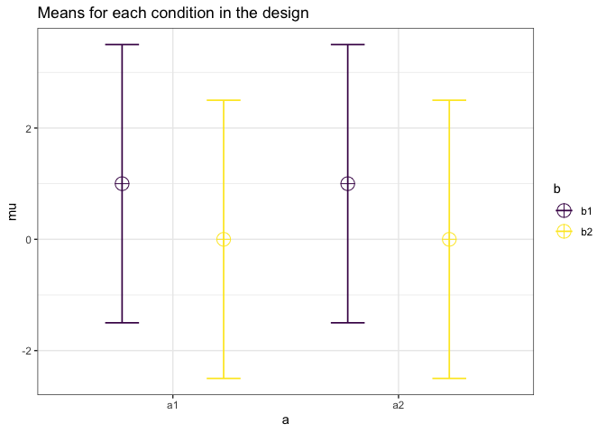
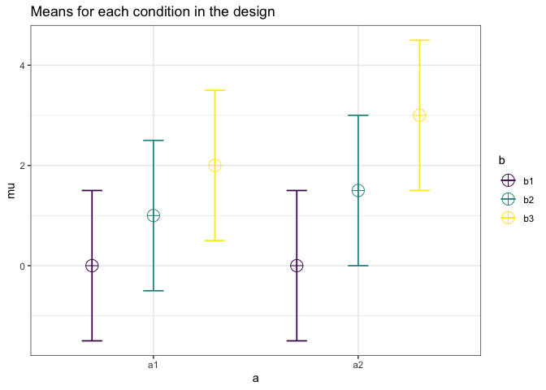

Factorial ANCOVA Validation: Two Way Design
================

``` r
knitr::opts_chunk$set(echo = TRUE)
library(simstudy)
library(data.table)
library(Superpower)
```

    ## Registered S3 methods overwritten by 'lme4':
    ##   method                          from
    ##   cooks.distance.influence.merMod car 
    ##   influence.merMod                car 
    ##   dfbeta.influence.merMod         car 
    ##   dfbetas.influence.merMod        car

``` r
library(car)
```

    ## Loading required package: carData

``` r
library(testthat)
set.seed(19256)
```

# Simulation 1

``` r
nsim = 5000
res_2x2a = vector()
res_2x2b = vector()
res_2x2ab = vector()
res_aov = vector()

for(i in 1:nsim){
  # Generate outcome and covariate matrix
  dt <- genCorData(
    20 * 4,
    mu = c(0, 0),
    sigma = 2.5,
    rho = .1,
    corstr = "cs",
    cnames = c("cov", "y1")
  )

# generate random treatment assignment
study1 = trtAssign(dt, 
                   n = 4, 
                   balanced = TRUE,
                   grpName = "group")

study1[, a := ifelse(group == 1 | group == 2,1,2)]

study1[, b := ifelse(group == 1 | group == 3,1,2)]
# add treatment effect
study1[, y := ifelse((group == 1 | group == 3), y1+1, y1)]
# factorize group
study1[, a := as.factor(a)]
study1[, b := as.factor(b)]
study1[, group := as.factor(group)]

study1[,.('means' = mean(y),'sd' = sd(y)), by = .(group)]
a = as.data.frame(anova(lm(y ~ cov + a*b, data = study1)))
a2 = as.data.frame(anova(lm(y ~ a*b, data = study1)))
res_aov = append(a2["b",]$`Pr(>F)`,
                   res_aov)

res_2x2a = append(a["a",]$`Pr(>F)`,
                   res_2x2a)
res_2x2b = append(a["b",]$`Pr(>F)`,
                   res_2x2b)
res_2x2ab = append(a["a:b",]$`Pr(>F)`,
                   res_2x2ab)

}
```

``` r
des1 = ANOVA_design(design = "2b*2b", n = 20, mu = c(1, 0, 1, 0), sd = 2.5)
```

<!-- -->

``` r
ex1 = ANOVA_exact2(des1, verbose=FALSE)


test_that("Simulation 1", {
  # check ANOVA result
  expect_equal(mean(res_aov < .05), ex1$main_results$power[2]/100,
               tolerance = .02)
  # Both should be about .81
  # Check ANCOVA result
  expect_equal(mean(res_2x2a < .05), 
               ANCOVA_analytic(design = "2b*2b",
                mu = c(1,0,1,0),
                n = 20,
                sd = 2.5,
                r2 = .1^2,
                n_cov = 1,
                alpha_level = .05,
                beta_level = NULL)$main_results$power[1]/100, 
               tolerance = .01)
  
    expect_equal(mean(res_2x2b < .05), 
               ANCOVA_analytic(design = "2b*2b",
                mu = c(1,0,1,0),
                n = 20,
                sd = 2.5,
                r2 = .1^2,
                n_cov = 1,
                alpha_level = .05,
                beta_level = NULL)$main_results$power[2]/100, 
               tolerance = .01)

})
```

    ## Test passed 🥳

# Simulation 2

``` r
res_2x3a = vector()
res_2x3b = vector()
res_2x3ab = vector()
res_aov = vector()

for(i in 1:nsim){
  # Generate outcome and covariate matrix
  dt <- genCorData(
    33 * 6,
    mu = c(0, 0),
    sigma = 1.5,
    rho = .4,
    corstr = "cs",
    cnames = c("cov", "y1")
  )

# generate random treatment assignment
study1 = trtAssign(dt, 
                   n = 6, 
                   balanced = TRUE,
                   grpName = "group")

study1[, a := ifelse(group == 1 | group == 2 | group == 3, 1, 2)]

study1[, b := ifelse(group == 1 | group == 4,1,
                     ifelse(group == 2 | group == 5,
                            2, 3))]
# add treatment effect
study1[, y := ifelse(group == 2, y1+1, 
                     ifelse(group == 3, y1+2,
                            ifelse(group == 5, y1+1.5,
                                   ifelse(group == 6, y1+3,y1))))]
# factorize group
study1[, a := as.factor(a)]
study1[, b := as.factor(b)]
study1[, group := as.factor(group)]

#library(ggplot2)
#ggplot(study1, aes(x=b,y=y,group=group)) + geom_boxplot() + facet_wrap(~a)

#a = as.data.frame(anova(lm(y ~ cov + a*b, data = study1)))

a = suppressMessages({suppressWarnings({
  as.data.frame(afex::aov_car(y ~ cov + a * b + Error(1 / id),
                              factorize = FALSE,
                              include_aov = FALSE,
                              data = study1)$anova_table)
  }) })

a2 = suppressMessages({suppressWarnings({
  as.data.frame(afex::aov_car(
    y ~  a * b + Error(1 / id),
    factorize = FALSE,
    include_aov = FALSE,
    data = study1
  )$anova_table)
  }) })

res_aov = append(a2["a",]$`Pr(>F)`,
                   res_aov)

res_2x3a = append(a["a",]$`Pr(>F)`,
                   res_2x3a)
res_2x3b = append(a["b",]$`Pr(>F)`,
                   res_2x3b)
res_2x3ab = append(a["a:b",]$`Pr(>F)`,
                   res_2x3ab)

}
```

``` r
des1 = ANOVA_design(design = "2b*3b", n = 33,
                    mu = c(0,1,2,0,1.5,3), 
                    sd = 1.5)
```

<!-- -->

``` r
ex1 = ANOVA_exact2(des1, verbose=FALSE)


test_that("Simulation 2", {
  
  expect_equal(mean(res_aov < .05), 
               ex1$main_results$power[1]/100,
               tolerance = .015)

  # Both should be about .81
  # Check ANCOVA result
  expect_equal(mean(res_2x3a < .05), 
               ANCOVA_analytic(design = "2b*3b",
                mu = c(0,1,2,0,1.5,3),
                n = 33,
                sd = 1.5,
                r2 = .4^2,
                n_cov = 1,
                alpha_level = .05,
                beta_level = NULL)$main_results$power[1]/100, 
               tolerance = .01)
  
    expect_equal(mean(res_2x3b < .05), 
               ANCOVA_analytic(design = "2b*3b",
                mu = c(0,1,2,0,1.5,3),
                n = 33,
                sd = 1.5,
                r2 = .4^2,
                n_cov = 1,
                alpha_level = .05,
                beta_level = NULL)$main_results$power[2]/100, 
               tolerance = .01)
    
        expect_equal(mean(res_2x3ab < .05), 
               ANCOVA_analytic(design = "2b*3b",
                mu = c(0,1,2,0,1.5,3),
                n = 33,
                sd = 1.5,
                r2 = .4^2,
                n_cov = 1,
                alpha_level = .05,
                beta_level = NULL)$main_results$power[3]/100, 
               tolerance = .01)

})
```

    ## Test passed 🥇

# Simulation 3

``` r
res_3x3a = vector()
res_3x3b = vector()
res_3x3ab = vector()
res_aov = vector()

for(i in 1:nsim){
  # Generate outcome and covariate matrix
  dt <- genCorData(
    17 * 9,
    mu = c(0, 0),
    sigma = 1.78,
    rho = .2,
    corstr = "cs",
    cnames = c("cov", "y1")
  )

# generate random treatment assignment
study1 = trtAssign(dt, 
                   n = 9, 
                   balanced = TRUE,
                   grpName = "group")

study1[, a := ifelse(group == 1 | 
                       group == 2 | 
                       group == 3, 1, 
                     ifelse(group == 4 |
                              group == 5 |
                              group == 6, 2,3))]

study1[, b := ifelse(group == 1 | 
                       group == 4 | 
                       group == 7, 1, 
                     ifelse(group == 2 |
                              group == 5 |
                              group == 8, 2,3))]
# add treatment effect
study1[, y := ifelse(a == 1, y1+1,
                     ifelse(a == 2, y1+1.5, y1+2))]
# factorize group
study1[, a := as.factor(a)]
study1[, b := as.factor(b)]
study1[, group := as.factor(group)]

a = suppressMessages({suppressWarnings({
  as.data.frame(afex::aov_car(y ~ cov + a * b + Error(1 / id),
                              factorize = FALSE,
                              include_aov = FALSE,
                              data = study1)$anova_table)
  }) })

a2 = suppressMessages({suppressWarnings({
  as.data.frame(afex::aov_car(
    y ~  a * b + Error(1 / id),
    factorize = FALSE,
    include_aov = FALSE,
    data = study1
  )$anova_table)
  }) })

res_aov = append(a2["a",]$`Pr(>F)`,
                   res_aov)

res_3x3a = append(a["a",]$`Pr(>F)`,
                   res_3x3a)
res_3x3b = append(a["b",]$`Pr(>F)`,
                   res_3x3b)
res_3x3ab = append(a["a:b",]$`Pr(>F)`,
                   res_3x3ab)

}
```

``` r
test_that("Simulation 3", {
  
  expect_equal(mean(res_aov < .05), 
               .72,
               tolerance = .015)

  # Both should be about .81
  # Check ANCOVA result
  expect_equal(mean(res_3x3a < .05), 
               ANCOVA_analytic(
                 design = "3b*3b",
                 mu = c(1, 1, 1, 1.5, 1.5, 1.5, 2, 2, 2),
                 n = 17,
                 sd = 1.78,
                 r2 = .2 ^ 2,
                 n_cov = 1,
                 alpha_level = .05,
                 beta_level = NULL)$main_results$power[1]/100, 
               tolerance = .015)
  
    expect_equal(mean(res_3x3b < .05), 
               ANCOVA_analytic(
                 design = "3b*3b",
                 mu = c(1, 1, 1, 1.5, 1.5, 1.5, 2, 2, 2),
                 n = 17,
                 sd = 1.78,
                 r2 = .2 ^ 2,
                 n_cov = 1,
                 alpha_level = .05,
                 beta_level = NULL
               )$main_results$power[2]/100, 
               tolerance = .01)
    
        expect_equal(mean(res_3x3ab < .05), 
               ANCOVA_analytic(                 
                 design = "3b*3b",
                 mu = c(1, 1, 1, 1.5, 1.5, 1.5, 2, 2, 2),
                 n = 17,
                 sd = 1.78,
                 r2 = .2 ^ 2,
                 n_cov = 1,
                 alpha_level = .05,
                 beta_level = NULL)$main_results$power[3]/100, 
               tolerance = .01)

})
```

    ## Test passed 😀
