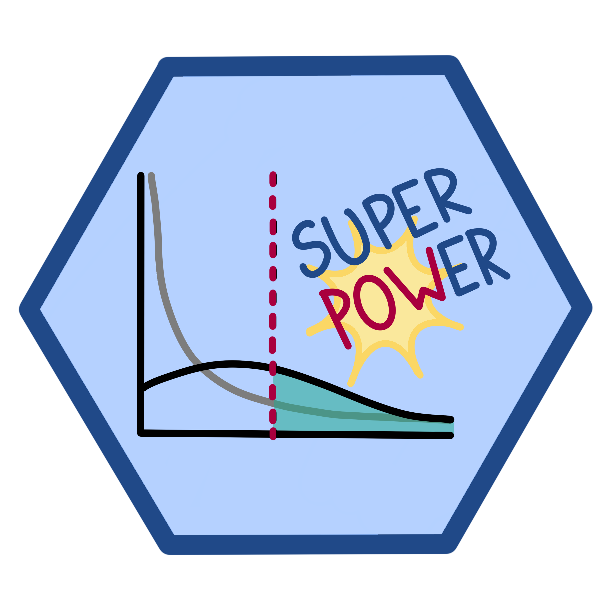

# Superpower 
```{r setup, include = FALSE}

library(Superpower)
suppressWarnings(library("badger"))

```
```{r hex,out.width="17%", eval=T, echo=F}

#knitr::include_graphics("Sticker/authors.png")
```
```{r authors,out.width="25%", eval=T, echo=F}
knitr::include_graphics("Sticker/authors.png")
```

<!-- rmarkdown v1 -->
<!-- README.md is generated from README.Rmd. Please edit that file -->

<!-- badges: start -->
[](https://travis-ci.com/arcaldwell49/superpower)
[](https://codecov.io/gh/arcaldwell49/Superpower)
`r badge_doi("10.31234/osf.io/baxsf", "yellow")`
<!-- badges: end -->


The goal of `Superpower` is to easily simulate factorial designs and empirically calculate power using a simulation approach. 
This package and its functions are intended to be utilized for prospective (a priori) power analysis. In addition to this site we have written a short [book](https://aaroncaldwell.us/SuperpowerBook/) documenting a wide range of applications of this package and how to perform power analysis outside this R package using custom code.

## Installation

You can install the most recent version of `Superpower` from [GitHub](https://github.com/arcaldwell49/Superpower) with:

``` r
devtools::install_github("arcaldwell49/Superpower")
```

Or you can install the stable version of Superpower from [CRAN](https://CRAN.R-project.org) with:


``` r
install.packages("Superpower")
```


## Other simulation packages

We started this project to create a simple way to do ANOVA power calculations that the average experimental scientist can use. However, there are many cases that an ANOVA may not be appropriate. Therefore, we suggest using other packages such as `simr` which allows for linear and generalized mixed models. Custom code can also be written and for such specialized simulations we highly recommend the `simstudy` R package.

* [simstudy](https://www.rdatagen.net/page/simstudy/): Simulation of Study Data
* [simr](https://github.com/pitakakariki/simr): Power Analysis of Generalised Linear Mixed Models by Simulation


