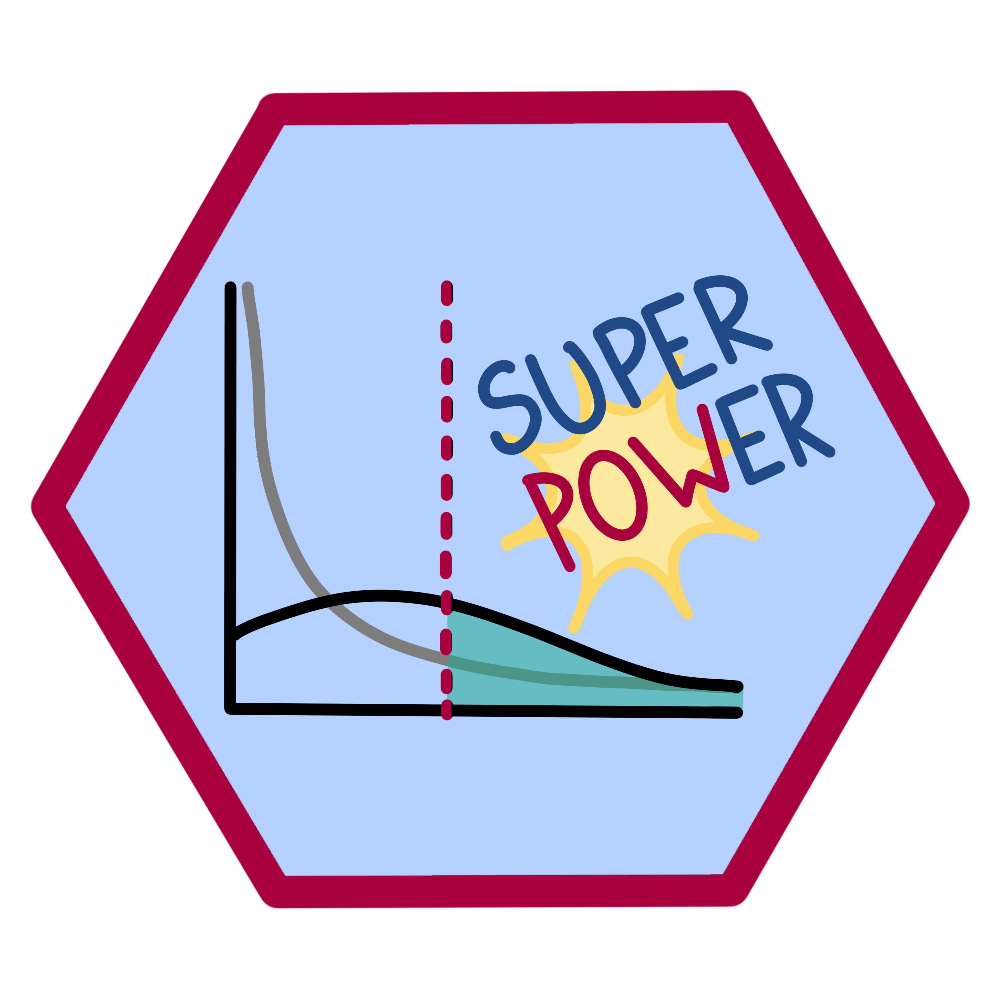

# Superpower 




<!-- badges: start -->
  [](https://github.com/arcaldwell49/Superpower/actions)
[](https://CRAN.R-project.org/package=Superpower)
[](https://app.codecov.io/gh/arcaldwell49/Superpower)
[](https://doi.org/10.31234/osf.io/baxsf)
<!-- badges: end -->


The goal of `Superpower` is to easily simulate factorial designs and empirically calculate power using a simulation approach. 
This package and its functions are intended to be utilized for prospective (a priori) power analysis. In addition to this site we have written a short [book](https://aaroncaldwell.us/SuperpowerBook/) documenting a wide range of applications of this package and how to perform power analysis outside this R package using custom code.

## Installation

You can install the most recent version of `Superpower` from [GitHub](https://github.com/arcaldwell49/Superpower) with:

``` r
devtools::install_github("arcaldwell49/Superpower")
```

Or you can install the stable version of Superpower from [CRAN](https://CRAN.R-project.org) with:


``` r
install.packages("Superpower")
```

## Citation

If you use `Superpower`, please consider citing the following:

Lakens, D., & Caldwell, A. R. (2021). Simulation-Based Power Analysis for Factorial Analysis of
  Variance Designs. *Advances in Methods and Practices in Psychological Science*, 4(1),
  251524592095150. https://doi.org/10.1177/2515245920951503

```
A BibTeX entry for LaTeX users is

  @Article{,
    doi = {10.1177/2515245920951503},
    url = {https://doi.org/10.1177/2515245920951503},
    year = {2021},
    volume = {4},
    number = {1},
    pages = {251524592095150},
    author = {Daniel Lakens and Aaron Caldwell},
    title = {Simulation-Based Power Analysis for Factorial Analysis of Variance Designs},
    journal = {Advances in Methods and Practices in Psychological Science},
  }
```

## Other Simulation & Power Analysis Packages

We started this project to create a simple way to do ANOVA power calculations that the average experimental scientist can use. However, there are many cases that an ANOVA may not be appropriate. Therefore, we suggest using other packages such as `simr` which allows for linear and generalized mixed models. Custom code can also be written and for such specialized simulations we highly recommend the `simstudy` R package. For sequential analyses and adaptive designs the `rpact` package will also be very helpful.

* [simstudy](https://www.rdatagen.net/page/simstudy/): Simulation of Study Data
* [faux](https://debruine.github.io/faux/): Simulate data with a specified structure.
* [simr](https://github.com/pitakakariki/simr): Power Analysis of Generalised Linear Mixed Models by Simulation
* [rpact](https://www.rpact.org/): Confirmatory Adaptive Clinical Trial Design, Simulation, and Analysis
* [pwr](https://github.com/heliosdrm/pwr): Basic functions for power analysis


