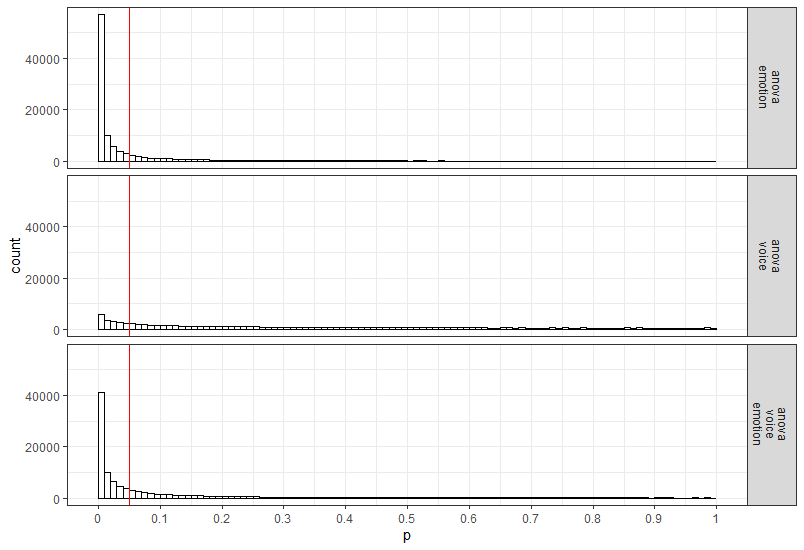

```{r setup, include=FALSE}
knitr::opts_chunk$set(echo = TRUE)
library(Superpower)
nsims = 250
```

The goal of Superpower is to easily simulate single factor and factorial designs and empirically calculate power using a simulation approach. Currently, the package can only calculate power for ANOVAs.
This app is intended to be utilized for prospective (a priori) power analysis. 
This vignette gives a brief overview of the package's capability. 
If you would like to see more information on this package please see our online [book](https://aaroncaldwell.us/SuperpowerBook/)

## Installation

You can install the developmental version of Superpower from [GitHub](https://github.com/arcaldwell49/Superpower) with:

``` r
devtools::install_github("arcaldwell49/Superpower")
```

## Superpower_options

Some functions have overlapping arguments (e.g., verbose and plot), and many users may want consistency in these arguments as they use these functions in their workflow. In order to see the options, all one has to do is call on the Superpower_options() function.

```{r}
Superpower_options()
```

The global option can be set by the user by calling on the individual arguments. Let's use the verbose argument as an example.

```{r}
Superpower_options("verbose")
Superpower_options("verbose" = FALSE) 
Superpower_options("verbose")
```

## ANOVA_design function

Currently the ANOVA_design function can create designs up three factors, for both within, between, and mixed designs. It requires the following input: design, n, mu, sd, r, and optionally allows you to set label_list. 

1. `design`: string that specifies the design (see below).
2. `n`: the sample size for each between subject condition.
3. `mu`: a vector with the means for each condition.
4. `sd`: the population standard deviation. Assumes homogeneity of variances (only one standard deviation can be provided).
5. `r`: the correlation for within designs (or 0 for between designs).
6. `label_list`: This is an optional  named list of words that indicates factor names and level names (see below).
7. A final optional setting is to specify if you want to output a plot or not (plot = TRUE or FALSE)

### Specifying the design using 'design'

'design' is used to specify the design. 
Every factor is specified with a number, indicating the number of levels of the factor, and a letter, b or w, to indicate whether the factor is manipulated between or within participants.
For example, a `2b` design has two between-participant groups. 
A `12w` design has one factor with 12 levels, all manipulated within-participants.
A "2b*3w" is a design with two factors (a 2b factor and a 3w factor), the first of which has 2 between participant levels (2b), and the second of which has 3 within participants levels (3w). 
**If there are multiple factors (the functions take up to three different factors) separate factors with a \* (asterisk)**. 
An example of a `2b*3w` design is a group of people in one condition who get a drug, and a group of people in another condition who get a placebo, and we measure their health before they take the pill, one day after they take the pill, and a week after they take the pill. 

### Specifying the means using 'mu'

Note that for each cell in the design, a mean must be provided. Thus, for a "2b*3w" design, 6 means need to be entered. 

Means need to be entered in the correct order. ANOVA_design outputs a plot so you can check if you entered all means as you intended. Always carefully check if the plot that is generated matches your expectations. 

The general principle is that the code generates factors, indicated by the factor names you entered in the label_list variable, (i.e., *condition* and *time*). Levels are indicated by factor names and levels (e.g., control_time1, control_time2, control_time3, etc). 

If your design has just one factor, just enter the means in the same order as the label_list (see below). For more factors, note the general pattern in the example below. Means are entered in the following order for a 3 factors design (each with 2 levels): 

1. a1 b1 c1
2. a1 b1 c2
3. a1 b2 c1
4. a1 b2 c2
5. a2 b1 c1
6. a2 b1 c2
7. a2 b2 c1
8. a2 b2 c2

So if you enter the means 1, 2, 3, 4, 5, 6, 7, 8 the first 4 means correspond to level 1 of factor 1, the second 4 means correspond to level 2 of factor 1. Within the first 4 means, the first 2 correspond to level 1 of factor 2, and within those 2 means, the first corresponds to level 1 of factor 3.

The plot below visualizes means from 1 to 8 being entered in a vector: `mu = c(1, 2, 3, 4, 5, 6, 7, 8)` so you can see how the basic ordering works.

```{r, fig.width=7, fig.height=4, echo=FALSE, message=FALSE, warning=FALSE}
design_result <- ANOVA_design(design = "2b*2w*2b",
                              n = 10, 
                              mu = c(1, 2, 3, 4, 5, 6, 7, 8), 
                              sd = 1, 
                              r = 0.9,
                              plot = FALSE)

design_result

plot(design_result)

```

### Specifying label names

To make sure the plots and tables with simulation results are easy to interpret, it really helps to name all factors and levels. You can enter the labels in the 'label_list' variable. You can also choose not to specify names. Then all factors are indicated by letters (a, b, c) and all levels by numbers (a1, a2, a3).

For the 2x3 design we have been using as an example, where there are 2 factors (condition and time of measurement), the first with 2 levels (placebo vs. medicine) and the second with three levels (time1, time2, and time3) we would enter the labels as follows: 

c("condition", "placebo", "medicine", "time", "time1", "time2", "time3")

As you can see, you follow the order of the design (`2b*3w`), and first write the **FACTOR** label (condition) followed by the levels of that factor (placebo and medicine). Then you write the second factor name (time) followed by the three labels for each **LEVEL** (time1, time2, time3). **Do not use spaces in the names (so not "time 1" but "time1" or "time_1").**

Some examples:

1. One within factor (time with 2 levels), 2w: 
  + `c("time", "morning", "evening")`
2. Two between factors (time and group, each with 2 levels), 2b*2b: 
  + `c("time", "morning", "evening", "group", "control", "experimental")`
3. Two between factors (time and group, first with 4 levels, second with 2 levels), 4b*2b: 
  + `c("time", "morning", "afternoon" ,"evening", "night", "group", "control", "experimental")`

### Specifying the correlation 

Depending on whether factors are manipulated within or between, variables are correlated, or not. You can set the correlation for within-participant factors. You can either assume all factors have the same correlation (e.g., r = 0.7), or enter the correlations for each pair of observations separately by specifying a correlation matrix.

#### Specifying the correlation matrix.

In a 2x2 within-participant design, with factors A and B, each with 2 levels, there are 6 possible comparisons that can be made.

1. A1 vs. A2
2. A1 vs. B1
3. A1 vs. B2
4. A2 vs. B1
5. A2 vs. B2
6. B1 vs. B2

The number of possible comparisons is the product of the levels of all factors squared minus the product of all factors, divided by two. For a 2x2 design where each factor has two levels, this is:

```{r}
(((2*2)^2)-(2*2))/2
```

The number of possible comparisons increases rapidly when adding factors and levels for each factor. For example, for a 2x2x4 design it is:

```{r}
(((2*2*4)^2)-(2*2*4))/2
```

Each of these comparisons can have their own correlation if the factor is manipulated within subjects (if the factor is manipulated between subjects the correlation is 0). These correlations determine the covariance matrix. Potvin and Schutz (2000) surveyed statistical tools for power analysis and conclude that most software packages are limited to one factor repeated measure designs and do not provide power calculations for within designs with multiple factor (which is still true for software such as G*Power). Furthermore, software solutions which were available at the time (DATASIM by Bradley, Russel, & Reeve, 1996) required researchers to assume correlations were of the same magnitude for all within factors, which is not always realistic. If you do not want to assume equal correlations for all paired comparisons, you can specify the correlation for each possible comparison.  

The order in which the correlations are entered in the vector should match the covariance matrix.
The order for a 2x2 design is given in the 6 item list above. The general pattern is that the matrix is filled from top to bottom, and left to right, illustrated by the increasing correlations in the table below.


| Factor | a1_b1 | a1_b2 | a2_b1 | a2_b2 |
|:------|-------|-------|-------|-------|
| a1_b1 | 1.00  |  0.91 |  0.92 |  0.93 |
| a1_b2 | 0.91  |  1.00 |  0.94 |  0.95 |
| a2_b1 | 0.92  |  0.94 |  1.00 |  0.96 |
| a2_b2 | 0.93  |  0.95 |  0.96 |  1.00 | 

The diagonal is generated dynamically (and all conditions are perfectly correlated with themselves).

We would enter this correlation matrix as:

```{r, fig.width=5, fig.height=4}
design_result <- ANOVA_design(design = "2w*2w",
                              n = 80,
                              mu = c(1.1, 1.2, 1.3, 1.4),
                              sd = 2,
                              r <- c(0.91, 0.92, 0.93, 0.94, 0.95, 0.96),
                              plot = FALSE)

design_result

plot(design_result)
```

We can check the correlation matrix by asking for it from the design_result object to check if it was entered the way we wanted:

```{r}
design_result$cor_mat
```

Note that we did not specify the label_list, and thus they are automatically created. 

### Specifying the sample size

You can set the sample size **per condition** by setting a value for n. The assumption is that you will collect equal sample sizes in all conditions [expanding Superpower to allow different sample sizes in each group is a planned future option].

### Specifying the standard deviation

You can set the common standard deviation by setting a value of sd. Superpower allows you to perform calculations under the assumption of homogeneity of variances (the standard deviation is the same across conditions), or you can *violate this assumption* by entering a vector of standard deviations (one for each condition). If multiple standard deviations are entered then we **highly recommend** that a null design is also simulated to see the impact of this assumption violation on type 1 error. Also, please note that there is always some uncertainty in which values you can expect in the study you are planning. It is therefore useful to perform sensitivity analyses (e.g., running the simulation with the expected standard deviation, but also with more conservative or even worst-case-scenario values).

# Simulation-Based Power Calculations

There are two ways to calculate the statistical power of a factorial design based on simulations. The first is to repeatedly simulate data for each condition based on the means, sample size, standard deviation, and correlation, under specific statistical assumptions (i.e., normally distributed). The `ANOVA_power` function allows you to perform power analyses based on repeatedly simulating normally distributed data. A second approach is to simulate a dataset that has *exactly* the desired properties - every cell of the design has n datapoints that have the desired mean and standard deviation, and correlation between groups (for a within design). By performing an ANOVA on this dataset, we can calculate the required statistics from the ANOVA result used to calculate the statistical power. The `ANOVA_exact` function allows you to calculate power based on this approach. The `ANOVA_power` function is a bit more flexible (e.g., we can use different ways to correct for multiple comparisons, or in future versions of the package allow you to simulate more realistic datasets that are not normally distributed), but the `ANOVA_exact` function is much faster (and takes seconds, instead of minutes or hours for a large number of simulations). 

## The ANOVA_power function

The ANOVA_power function takes the result from the ANOVA_design function, and simulates data nsims times using a specified alpha level. As output, it provides a table for the ANOVA results, and the results for all independent comparisons.

It requires the following input: ANOVA_design, alpha_level, p_adjust, nsims, seed, and verbose. 

1. `design_result`: Output from the ANOVA_design function saved as an object
2. `alpha_level`: Alpha level used to determine statistical significance
3. `p_adjust`: Correction for multiple comparisons for exploratory ANOVA/MANOVA using the [p.adjust](https://www.rdocumentation.org/packages/stats/versions/3.5.3/topics/p.adjust) function 
4. `nsims`: number of simulations to perform
5. `seed`: Set seed for reproducible results
6. `verbose`: Set to FALSE to not print results (default = TRUE)

With the following optional input:

1. `contrast_type`: This input will determine the contrast type for the emmeans comparisons. The default is "pairwise". Possible input is limited to "pairwise", "revpairwise", "eff", "consec", "poly", "del.eff", "trt.vs.ctrl", "trt.vs.ctrl1", "trt.vs.ctrlk", and "mean_chg". See help("contrast-methods") with the `emmeans` package loaded for more information.
2. `emm_model`: emmeans accepts univariate and multivariate models. This will only make a difference if a within-subjects factor is included in the design. Setting this option to "multivariate" will result in the "multivariate" model being selected for the emmeans comparisons. *This is generally recommended if you are interested in the estimated marginal means (e.g., pairwise comparisons)*.
3. `emm_comp`: This selects the factors to be included for the emmeans. The default is to take the `frml2` object from the results of `ANOVA_design`, and with the default `contrast_type` = "pairwise", results in *all* the pairwise comparisons being performed. The simple effects can also be performed by including | in the emm_comp formula. For example, with two factors (e.g., a and b) `emm_comp = "a+b"` results in all pairwise comparisons being performed while `emm_comp = "a|b"` will result in pairwise comparisons across all levels of a **within** each level of b. 
4. `emm_p_adjust`: adjustment for multiple comparisons. Note: **this feature only works with** `ANOVA_power`. Currently, this feature includes the Tukey ("tukey"), Scheffe ("scheffe"), Sidak ("sidak"), and Dunnett ("dunnettx") adjustments in addition to all of the options for `p_adjust`.

Simulations typically take some time. Larger numbers of simulations yield more accurate results, but also take a long time. We recommend testing the set up with 100 simulations, and run 1000 if the set-up is correct (or 10000 if you are getting a coffee, or 100.000 if you are about accuracy to digits behind the decimal). 

## The ANOVA_exact function

The ANOVA_exact function takes the result from the ANOVA_design function, and simulates one dataset that exactly matches the desired properties (using the `mvrnorm` function from the `MASS` package, using the setting `empirical = TRUE`). This dataset is used to perform a single ANOVA, and the results are used to compute power (thanks to Chris Aberson for inspiring this approach). *Important Note:* the original function ANOVA_exact was limited by the sample size; now we have ANOVA_exact2 that has a similar internal process as ANOVA_exact. However, ANOVA_exact2 calculates the effect sizes separately from the simulation which allows us to extend the range of sample sizes that are covered, and provides a more accurate estimate of power.

ANOVA_exact requires the following input: ANOVA_design, alpha_level, and verbose. 

1. `design_result`: Output from the ANOVA_design function saved as an object
2. `alpha_level`: Alpha level used to determine statistical significance
3. `verbose`: Set to FALSE to not print results (default = TRUE)

Compared to the ANOVA_power function, the ANOVA_exact approach is much faster (it requires simulating only a single dataset). Currently the only difference is that ANOVA_exact does not allow you to examine the consequences of correcting for multiple comparisons (there is no `p_adjust` option), and ANOVA_exact does not work for sample sizes that are less than the product of the factor levels (e.g., "2b*2b" design would need to have a minimum `n` of 5). If you are dealing with small sample sizes then you will need to use the ANOVA_exact2 function.

## An Example

Imagine you plan to perform a study in which participants interact with an artificial voice assistant that sounds either like a human or like a robot, and who sounds either cheerful or sad.
In the example below, 1000 simulations for a 2*2 mixed design (first factor, voice, is manipulated between participants, the second factor, emotion, is manipulated within participants) are performed. 
The sample size is 40 in each between subject condition (so 80 participants in total), the assumed population standard deviation is 1.03, the correlation for the within factors is 0.8, and the means are 1.03, 1.21, 0.98, 1.01. No correction for multiple comparisons is applied. The alpha level used as a significance threshold is set to 0.01 for this simulation.

```{r, fig.width=7, fig.height=4}
design_result <- ANOVA_design(design = "2b*2w",
                   n = 40, 
                   mu = c(1.03, 1.41, 0.98, 1.01), 
                   sd = 1.03, 
                   r = 0.8, 
                   label_list = list("voice"  = c("human", "robot"),
                                     "emotion" = c( "cheerful", "sad")),
                   plot = TRUE)
```

```{r}
power_result_vig_1 <- ANOVA_power(design_result, 
                                  alpha = 0.05, 
                                  nsims = nsims, 
                                  seed = 1234)

```

The result for the power simulation is printed, and has two sections (which can be suppressed by setting verbose = FALSE). The first table provides power (from 0 to 100%) and effect sizes (partial eta-squared) for the ANOVA result. We see the results for the main effects of factor voice, emotion, and the voice*emotion interaction. In addition, since we are taking a random sample of 250 simulations we can calculate a confidence interval of the results with the `confint` method.

```{r}
knitr::kable(confint(power_result_vig_1, level = .98))
```

The result for the power simulation reveal power is highest for the main effect of emotion. Remember that this is the within-subjects factor, and the means are highly correlated (0.8) - so we have high power for within comparisons. Power is lower for the interaction, and very low for the main effect of voice.

An ANOVA is typically followed up with contrasts. A statistical hypothesis often predicts not just an interaction, but also the shape of an interaction. For example, when looking at the plot of our design above, we might be specifically interested in comparing the independent effect for the cheerful vs sad human voice assistant, and the difference for sad voice when they are robotic or human. The second table provides the power for *t*-tests for all comparisons, and the effect sizes (Cohen's d for between-subject contrasts, and Cohen's $d_z$ for within-subject contrasts, see [Lakens, 2013](https://www.frontiersin.org/articles/10.3389/fpsyg.2013.00863/full)).

Power is relatively high for the differences between within-participant conditions, and power is very low for the minor differences among the three similar means (1.03, 0.98, 1.01). In addition to the two tables, the ANOVA_power function returns the raw simulation data (all *p*-values and effect sizes for each simulation, see simulation_result$sim_data) and a plot showing the *p*-value distributions for all tests in the ANOVA.



## Power in a Two Group One-Way ANOVA

Imagine we aim to design a study to test the hypothesis that giving people a pet to take care of will increase their life satisfaction. We have a control condition, and a condition where people get a pet, and randomly assign participants to either condition. We can simulate a One-Way ANOVA with a specified alpha, sample size, and effect size, on see which statistical power we would have for the ANOVA. We expect pets to increase life-satisfaction compared to the control condition. Based on work by Pavot and Diener (1993) we believe that we can expect responses on the life-satisfaction scale to have a mean of approximately 24 in our population, with a standard deviation of 6.4. We expect having a pet increases life satisfaction with approximately 2.2 scale points for participants who get a pet. We plan to collect data from 200 participants in total, with 100 participants in each condition. We examine the statistical power our design would have to detect the differences we predict.

```{r, fig.width=7, fig.height=4}
design <- "2b"
n <- 100
mu <- c(24, 26.2)
sd <- 6.4
label_list = list("condition" = c("control", "pet")) #

design_result <- ANOVA_design(design = design,
                              n = n,
                              mu = mu, 
                              sd = sd, 
                              label_list = label_list)
```
```{r}
power_result_vig_2 <- ANOVA_power(design_result, 
                                  nsims = nsims, 
                                  seed = 1234)
#Note we do not specify any correlation in the ANOVA_design function (default r = 0), nor do we specify an alpha in the ANOVA_power function (default is 0.05)

knitr::kable(confint(power_result_vig_2, level = .98))
```


The result shows that we have exactly the same power for the ANOVA, as we have for the *t*-test. This is because when there are only two groups, these tests are mathematically identical. In a study with 100 participants per condition, we would have quite low power (around 67.7%). An ANOVA with 2 groups is identical to a *t*-test. For our example, Cohen's d (the standardized mean difference) is 2.2/6.4, or d = 0.34375 for the difference between the control condition and having pets, which we can use to easily compute the expected power for these simple comparisons using the pwr package.

```{r}
library(pwr)
pwr.t.test(d = 2.2/6.4,
           n = 100,
           sig.level = 0.05,
           type = "two.sample",
           alternative = "two.sided")$power

```

We can also directly compute Cohen's f from Cohen's d for two groups, as Cohen (1988) describes, because f = $\frac{1}{2}d$. So f = 0.5*0.34375 = 0.171875. And indeed, power analysis using the pwr package yields the same result using the pwr.anova.test as the power.t.test.

```{r}
pwr.anova.test(n = 100,
               k = 2,
               f = 0.171875,
               sig.level = 0.05)$power
```

This analysis tells us that running the study with 100 participants in each condition is quite likely to *not* yield a significant test result, even if our expected pattern of differences is true. This is clearly not optimal. If we perform a study, we would like to get informative results - which means we should be likely to detect effect we expect or care about, if these effects exist, and not find effects, if they are absent. 

How many participants do we need for sufficient power? Given the expected difference and standard deviation, d = 0.34375, and f = 0.171875, we can increase the number of participants and run the simulation until we are content. The desired power depends on the cost of a Type 2 error. Cohen recommended to aim for 80% power, or a Type 2 error rate of 20%. I personally find a 20% Type 2 error rate too high, and not balanced enough compared to a much stricter Type 1 error rate (often by default 5%, although you should justify your alpha, for example by [reducing it as a function of the sample size](http://daniellakens.blogspot.com/2018/12/testing-whether-observed-data-should.html), or by [balancing error rates](http://daniellakens.blogspot.com/2019/05/justifying-your-alpha-by-minimizing-or.html)). Let's say we want to aim for 90% power.

Especially when you are increasing the sample size in your design to figure out how many participants you would need, it is much more efficient to use the `ANOVA_exact` function. You can see in the code below that we slowly increase the sample size and find that 180 participants give a bit more than 90% power.

```{r, fig.width=7, fig.height=4}
design_result <- ANOVA_design(design = "2b",
                   n = 100, 
                   mu = c(24, 26.2), 
                   sd = 6.4, 
                   label_list = list("condition" = c("control", "pet")),
                   plot = TRUE)

ANOVA_exact(design_result,
            verbose = FALSE)$main_results$power
# power of 67.7 is a bit low. Let's increase it a bit to n = 150 to see if we are closer to our goal of 90% power.

design_result <- ANOVA_design(design = "2b",
                   n = 150, 
                   mu = c(24, 26.2), 
                   sd = 6.4, 
                   label_list = list("condition" = c("control", "pet")),
                   plot = FALSE)

ANOVA_exact(design_result,
            verbose = FALSE)$main_results$power
# Close, but not there yet. Let's try n = 175 

design_result <- ANOVA_design(design = "2b",
                   n = 175, 
                   mu = c(24, 26.2), 
                   sd = 6.4, 
                   label_list = list("condition" = c("control", "pet")),
                   plot = FALSE)

ANOVA_exact(design_result,
            verbose = FALSE)$main_results$power
#Very close. Let's add a few more and try n = 180

design_result <- ANOVA_design(design = "2b",
                   n = 180, 
                   mu = c(24, 26.2), 
                   sd = 6.4, 
                   label_list = list("condition" = c("control", "pet")),
                   plot = FALSE)

ANOVA_exact(design_result,
            verbose = FALSE)$main_results$power

```

# Plotting Power

## The plot_power function

Simulation based power analyses require you to increase to sample size until power is high enough to reach your desired Type 2 error rate. To facilitate this trial and error process you can use the `plot_power` function to plot the power across a range of sample sizes to produce a power curve.

plot_power requires the following input: ANOVA_design, max_n, and plot. 

1. `design_result`: Output from the ANOVA_design function saved as an object
2. `min_n`: The minimum sample size you want to plot in the power curve
2. `max_n`: The maximum sample size you want to plot in the power curve
3. `plot`: Set to FALSE to not print the plot (default = `TRUE`)

With the following optional input:

1. `emm`: tell the function to run emmeans or not; default is set to `FALSE`.
1. `contrast_type`: This input will determine the contrast type for the emmeans comparisons. The default is "pairwise". Possible input is limited to "pairwise", "revpairwise", "eff", "consec", "poly", "del.eff", "trt.vs.ctrl", "trt.vs.ctrl1", "trt.vs.ctrlk", and "mean_chg". See help("contrast-methods") with the `emmeans` package loaded for more information.
2. `emm_model`: emmeans accepts univariate and multivariate models. This will only make a difference if a within-subjects factor is included in the design. Setting this option to "multivariate" will result in the "multivariate" model being selected for the emmeans comparisons. *This is generally recommended if you are interested in the estimated marginal means*.
3. `emm_comp`: This selects the factors to be included for the emmeans. The default is to take the `frml2` object from the results of `ANOVA_design`, and with the default `contrast_type = "pairwise"`, results in *all* the pairwise comparisons being performed. The simple effects can also be performed by including | in the emm_comp formula. For example, with two factors (e.g., a and b) `emm_comp = "a+b"` results in all pairwise comparisons being performed while `emm_comp = "a|b"` will result in pairwise comparisons across all levels of a **within** each level of b. 

The `plot_power` functions simulates power up to a sample size of `max_n` using the `ANOVA_exact` function. Although it is relatively fast, with large sample size to can take some time to produce. In the figure below we can easily see that, assuming the true pattern of means and standard deviations represents our expected pattern of means and standard deviations, we have 80% power around 135 participants per condition, 90% power around 180 participants per condition, and 95% power around 225 participants per condition.

```{r, fig.width=7, fig.height=4}
plot_power(design_result, min_n = 10, max_n = 250)
```

Because the true pattern of means is always unknown, it is sensible to examine the power across a range of scenarios. 

As these different plots can make clear, your study never really has a known statistical power. Because the true effect size (i.e., the pattern of means and standard deviations) is unknown, the true power of your study is unknown. A study has 90% power *assuming a specific effect size*, but if the effect size is different than what you expected, the true power can be either higher or lower. We should therefore always talk about the 'expected' power when we do an a-priori power analysis, and provide a good justification for our expectations (i.e., for the pattern of means, standard deviations, and correlations for within designs).

## Power-Sensitivity Relationship: Morey Plots

There is a direct relationship between standardized effect sizes and statistical power. Sometimes it may be useful to see the relationship between the effect size and power. That is where the `morey_plot` functions come in handy. In essence, you can plot statistical power (y-axis) as a function of effect size (x-axis; Cohen's *f* or Cohen's *d*). In addition, multiple sample sizes (facets) and alpha levels (color). For a *t*-test, the type of test (paired, one-sample, or two-sample) and alternative hypothesis (one.sided or two.sided) can be provided.

```{r morey1, fig.width=7, fig.height=4}
morey_plot.ttest(
  es = seq(.1, .5, .01),
  n = c(10, 20),
  alpha_level = c(.05, .075),
  type = "paired",
  alternative = "one.sided"
)
```

For the *F*-test, the options are a little different. First, instead of sample size, the numerator and denominator degrees of freedom must be provided (multiple values can be provided for either or both). Second, the effect size is now in the form of Cohen's *f*. Third, there is no type or alternative argument. Lastly, there is the option to set the non-centrality argument to a "liberal" lambda; this has a minuscule effect on power but I suggest that the liberal_lambda argument be set to FALSE.

```{r morey2, fig.width=7, fig.height=6}
morey_plot.ftest(
  es = seq(.1, .5, .01),
  num_df = c(1, 2),
  den_df = c(20,30),
  alpha_level = c(.05, .075),
  liberal_lambda = FALSE
)
```

