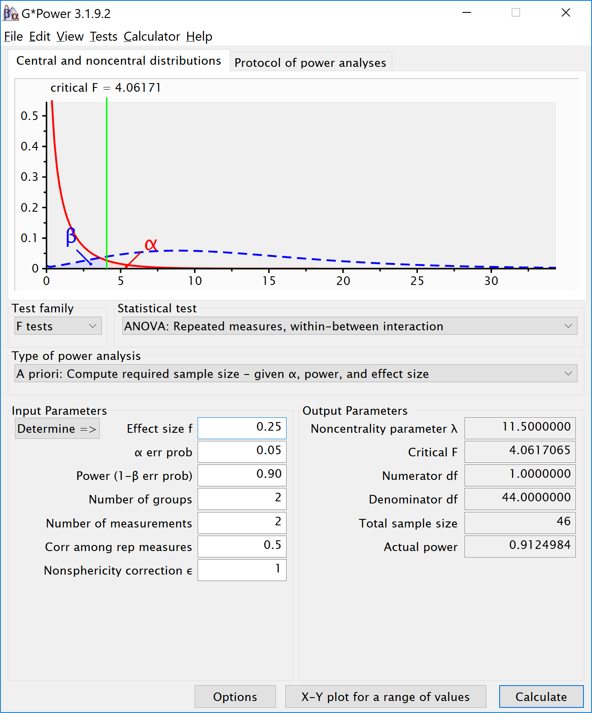

```{r setup, include = FALSE}
knitr::opts_chunk$set(
  collapse = TRUE,
  comment = "#>",
  echo = TRUE
)
```

```{r}
library(Superpower)
Superpower_options(verbose = FALSE,
                   plot = FALSE)
nsims = 250
```

In this vignette we will quickly demonstrate a few variations on ANOVA designs and how to implement them in `Superpower`. To see even more designs, please check out our [book](https://aaroncaldwell.us/SuperpowerBook/)

# Three between subject conditions

Imagine we aim to design a study to test the hypothesis that giving people a pet to take care of will increase their life satisfaction. We have a control condition, a 'cat' pet condition, and a 'dog' pet condition. We can simulate a One-Way ANOVA with a specified alpha, sample size, and effect size, and see the statistical power we would have for the ANOVA and the follow-up comparisons. We expect all pets to increase life-satisfaction compared to the control condition. Obviously, we also expect the people who are in the 'dog' pet condition to have even greater life-satisfaction than people in the 'cat' pet condition. Based on work by Pavot and Diener (1993) we again assume that we can expect responses on the life-satisfaction scale to have a mean of approximately 24 in our population, with a standard deviation of 6.4. We expect having a pet increases life satisfaction with approximately 2.2 scale points for participants who get a cat, and 2.6 scale points for participants who get a dog. We initially consider collecting data from 150 participants in total, with 50 participants in each condition. But before we proceed with the data collection, we examine the statistical power our design would have to detect the differences we predict.

```{r, fig.width=7, fig.height=4}
design <- "3b"
n <- 50
mu <- c(24, 26.2, 26.6)
sd <- 6.4
labelnames <- c("condition", "control", "cat", "dog") #

design_result <- ANOVA_design(design = design,
                   n = n, 
                   mu = mu, 
                   sd = sd, 
                   labelnames = labelnames,
                   plot = TRUE)
```
```
ANOVA_exact2(design_result,
            emm = TRUE) # Pairwise emmeans will automatically run
            
#> Power and Effect sizes for ANOVA tests
#>             power partial_eta_squared cohen_f non_centrality
#> condition 47.5236              0.0314    0.18         4.7651
#> 
#> Power and Effect sizes for pairwise comparisons (t-tests)
#>                                   power effect_size
#> p_condition_control_condition_cat 39.83        0.34
#> p_condition_control_condition_dog 52.05        0.41
#> p_condition_cat_condition_dog      6.10        0.06
#> 
#> Power and Effect sizes for estimated marginal means
#>                            contrast  power partial_eta_squared cohen_f
#> 1 condition_cat - condition_control 39.909           0.0196190 0.14146
#> 2     condition_cat - condition_dog  6.107           0.0006611 0.02572
#> 3 condition_control - condition_dog 52.148           0.0271902 0.16718
#>   non_centrality
#> 1        2.94171
#> 2        0.09725
#> 3        4.10867
```

The result shows that you would have quite low power with 50 participants, both for the overall ANOVA (just below 50% power), as for the follow up comparisons (approximately 40% power for the control vs cat condition, just above 50% for the control vs dogs condition, and a really low power (around 6%, just above the Type 1 error rate of 5%) for the expected difference between cats and dogs. We can easily confirm the expected power for these simple comparisons using the pwr package.
For our example, Cohen's d (the standardized mean difference) is 2.2/6.4, or d = 0.34375 for the difference between the control condition and cats, 2.6/6.4 of d = 0.40625 for the difference between the control condition and dogs, and 0.4/6.4 or d = 0.0625 for the difference between cats and dogs as pets. 

```{r}
library(pwr)
pwr.t.test(d = 2.2/6.4,
           n = 50,
           sig.level = 0.05,
           type="two.sample",
           alternative="two.sided")$power

pwr.t.test(d = 2.6/6.4,
           n = 50,
           sig.level = 0.05,
           type="two.sample",
           alternative="two.sided")$power

pwr.t.test(d = 0.4/6.4,
           n = 50,
           sig.level = 0.05,
           type="two.sample",
           alternative="two.sided")$power

```

It is clear we would need to collect more participants in each group to increase our power. We can plot a power curve across a range of sample sizes to see how much we need to increase the sample size. 

```{r eval=FALSE}
plot_power(design_result, min_n = 10, max_n = 250)
```

We see 134 participants give us around 90% power for the ANOVA. But we should also check the power for the comparison of the control condition and the cat condition. 

```{r, fig.width=7, fig.height=4}
design <- "3b"
n <- 134
mu <- c(24, 26.2, 26.6)
sd <- 6.4
labelnames <- c("condition", "control", "cat", "dog") #

design_result <- ANOVA_design(design = design,
                   n = n, 
                   mu = mu, 
                   sd = sd, 
                   labelnames = labelnames,
                   plot = FALSE) #do not print the plot (same as above)

ANOVA_exact2(design_result,
             emm = TRUE)

n <- 180
design_result <- ANOVA_design(design = design,
                   n = n, 
                   mu = mu, 
                   sd = sd, 
                   labelnames = labelnames,
                   plot = FALSE) #do not print the plot (same as above)

ANOVA_exact2(design_result,
             emm = TRUE)

n <- 5380
design_result <- ANOVA_design(design = design,
                   n = n, 
                   mu = mu, 
                   sd = sd, 
                   labelnames = labelnames,
                   plot = FALSE) #do not print the plot (same as above)

ANOVA_exact2(design_result,
             emm = TRUE)

```

With 134 participants per condition, power for this simple comparison is only 80%. If we want to aim for 90% power for follow up tests, we need more participants. 180 participants provides good power for the follow-up comparison between control and cats. But power for the difference between cats and dogs is incredibly low. We would need 5380 participants to have 90% power for that comparison. This is possible if you can easily collect data, but might make this specific question impossible to reliably answer if data collection is costly. Realizing you can not reliably study a question is an important aspect of a-priori power analysis.

# Power in Repeated Measures ANOVA

In a repeated measures design multiple observations are collected from the same participants. In the simplest case, where there are two repeated observations, a repeated measures ANOVA equals a dependent or paired *t*-test. Let's explore the impact of this correlation on the power of a repeated measures ANOVA.

### Two within conditions

To illustrate the effect of correlated observations, we start by simulating data for a medium effect size for a dependent (or paired, or within-subject) *t*-test. Let's first look at G*power. If we want to perform an a-priori power analysis, we are asked to fill in the effect size $d_z$. As Cohen (1988) writes, "The Z subscript is used to emphasize the fact that our raw score unit is no longer X or Y, but Z", where Z are the difference scores of X-Y. 

```{r, out.width = "600px", echo=FALSE}
knitr::include_graphics("screenshots/gpower_9.png")
```

Within designs can have greater power to detect differences than between designs because the values are correlated, and a within design requires less participants because each participant provides multiple observations. One difference between an independent *t*-test and a dependent *t*-test is that an independent *t*-test has 2(n-1) degrees of freedom, while a dependent *t*-test has (n-1) degrees of freedom. The sample size needed in a two-group within-design (NW) relative to the sample needed in two-group between-designs (NB), assuming normal distributions, and ignoring the difference in degrees of freedom between the two types of tests, is (from Maxwell & Delaney, 2004, p. 561, formula 45): 

$N_{W}=\frac{N_{B}(1-\rho)}{2}$

The division by 2 in the equation is due to the fact that in a two-condition within design every participant provides two data-points. The extent to which this reduces the sample size compared to a between-subject design depends on the correlation (*r*) between the two dependent variables, as indicated by the 1-r part of the equation. If the correlation is 0, a within-subject design needs half as many participants as a between-subject design (e.g., 64 instead 128 participants), simply because every participants provides 2 datapoints. The higher the correlation, the larger the relative benefit of within designs, and whenever the correlation is negative (up to -1) the relative benefit disappears. 

Whereas in an independent *t*-test the two observations are uncorrelated, in a within design the observations are correlated. This has an effect on the standard deviation of the difference scores. In turn, because the standardized effect size is the mean difference divided by the standard deviation of the difference scores, the correlation has an effect on the standardized mean difference in a within design, Cohen's $d_z$. The relation, as Cohen (1988, formula 2.3.7) explains, is:

$\sigma_{z}=\sigma\sqrt{2(1-\rho)}$

Therefore, the relation between dz and d is $\sqrt{2(1-\rho)}$. As Cohen (1988) writes: "In other words, a given difference between population means for matched (dependent) samples is standardized by a value which is $\sqrt{2(1-\rho)}$ as large as would be the case were they independent. If we enter a correlation of 0.5 in the formula, we get $\sqrt{2(0.5)}=1$. When the correlation is 0.5, d = $d_z$. When there is a strong correlation between dependent variables, for example r = 0.9, we get $d=d_{z}\sqrt{2(1-0.9)}$, and a $d_z$ of 1 would be a d = 0.45. Reversely, $d_{z}=\frac{d}{\sqrt{2(1-r)}}$, so with a r = 0.9, a d of 1 would be a $d_z$ = 2.24. Some consider this increase in $d_z$ compared to d when observations are strongly correlated an 'inflation' when estimating effect sizes, but since the reduction in the standard deviation of the difference scores due to the correlation makes it easier to distinguish signal from noise in a hypothesis test, it leads to a clear power benefit. 

There is no equivalent $f_z$ for Cohen's f for a within subject ANOVA. For two groups, we can directly compute Cohen's f from Cohen's d, as Cohen (1988) describes, because f = $\frac{1}{2}d$. For a d = 0.5, f = 0.25. In G\*power we can run a 2 group within-subject power analysis for ANOVA. We plan for 80% power, and reproduce the analysis above for the dependent *t*-test. This works because the correlation is set to 0.5, when d = $d_z$, and thus the transformation of f=$\frac{1}{2}d$ works.  

```{r, out.width = "600px", echo=FALSE}
knitr::include_graphics("screenshots/gpower_1.png")
```

If we change the correlation to 0.7 and keep all other settings the same, the repeated measure a-priori power analysis yields a sample of 21. The correlation increases the power for the test. 

```{r, out.width = "600px", echo=FALSE}
knitr::include_graphics("screenshots/gpower_11.png")
```

To reproduce this analysis in G\*power with a dependent *t*-test we need to change $d_z$ following the formula above, $d_{z}=\frac{0.5}{\sqrt{2(1-0.7)}}$, which yields $d_z$ = `r 0.5/sqrt(2*(1-0.7))`. If we enter this value in G\*power for an a-priori power analysis, we get the exact same results (as we should, since an repeated measures ANOVA with 2 groups equals a dependent *t*-test). This example illustrates that the correlation between dependent variables always factors into a power analysis, both for a dependent *t*-test, and for a repeated measures ANOVA. Because a dependent *t*-test uses $d_z$ the correlation might be less visible, but given the relation between d and $d_z$, the correlation is always taken into account and can greatly improve power for within designs compared to between designs.

```{r, out.width = "600px", echo=FALSE}
knitr::include_graphics("screenshots/gpower_10.png")
```

We can perform both these power analyses using simulations as well. We set groups to 2 for the simulation, n = 34 (which should give 80.777 power, according to g\*power), a correlation among repeated measures of 0.5, and an alpha of 0.05. In this case, we simulate data with means -0.25  and 0.25, and set the sd to 1. This means we have a mean difference of 0.5, and a Cohen's d of 0.5/1 = 0.5. In the first example, we set the correlation to 0.5, and the result should be 80.777% power, and an effect size estimate of 0.5 for the simple effect. We also calculate partial eta-squared for the ANOVA, which equals $\frac{f^2}{f^2+1}$, or 0.05882353.

```{r, fig.width=7, fig.height=4}
K <- 2
n <- 34
sd <- 1
r <- 0.5
alpha = 0.05
f <- 0.25
f2 <- f^2
ES <- f2/(f2+1)
ES
mu <- mu_from_ES(K = K, ES = ES)
design = paste(K,"w",sep="")
labelnames <- c("speed", "fast", "slow")

design_result <- ANOVA_design(design = design,
                              n = n, 
                              mu = mu, 
                              sd = sd, 
                              r = r, 
                              labelnames = labelnames,
                              plot = TRUE)

ANOVA_exact2(design_result,
            emm = TRUE)
```

The results of the exact simulation approach are indeed to 80.777%. Note that the simulation calculates Cohen's $d_z$ effect sizes for paired comparisons - which here given the correlation of 0.5 is also 0.5 for a medium effect size. 

We should see a larger $d_z$ if we increase the correlation, keeping the sample size the same, following the example in Gpower above. We repeat the simulation, and the only difference is a correlation between dependent variables of 0.7. This should yield an effect size $d_z$ = `r 0.5/sqrt(2*(1-0.7))`.

```{r, fig.width=7, fig.height=4}
K <- 2
n <- 34
sd <- 1
r <- 0.7
alpha = 0.05
f <- 0.25
f2 <- f^2
ES <- f2/(f2+1)
ES
mu <- mu_from_ES(K = K, ES = ES)
design = paste(K,"w",sep="")
labelnames <- c("speed", "fast", "slow")

design_result <- ANOVA_design(design = design,
                              n = n, 
                              mu = mu, 
                              sd = sd, 
                              r = r, 
                              labelnames = labelnames,
                              plot = TRUE)

ANOVA_exact2(design_result,
            emm = TRUE)
```

### Power in Repeated Measures ANOVA with More than 2 Groups

We will examine a repeated measures experiment with 3 within-participant conditions, to illustrate how a repeated measures ANOVA extends a dependent *t*-test. In the example for a two-group within design we provided a specific formula for the sample size benefit for two groups. The sample size needed in within-designs (NW) with more than 2 conditions, relative to the sample needed in between-designs (NB), assuming normal distributions and compound symmetry, and ignoring the difference in degrees of freedom between the two types of tests, is (from Maxwell & Delaney, 2004, p. 562, formula 47): 

$N_{W}=\frac{N_{B}(1-\rho)}{a}$

Where a is the number of within-subject levels. 

### The relation between Cohen's f and Cohen's d

Whereas in the case of a repeated measures ANOVA with 2 groups we could explain the principles of a power analysis by comparing our test against a *t*-test and Cohen's d, this becomes more difficult when we have more than 2 groups. It is more useful to explain how to directly calculate Cohen's f, the effect size used in power analyses for ANOVA. Cohen's f is calculated following Cohen, 1988, formula 8.2.1 and 8.2.2:

$f = \sqrt{\frac{\frac{\sum(\mu-\overline{\mu})^2)}N}\sigma}$ 

Imagine we have a within-subject experiment with 3 conditions. We ask people what they mood is when their alarm clock wakes them up, when they wake up naturally on a week day, and when they wake up naturally on a weekend day. Based on pilot data, we expect the means (on a 7 point validated mood scale) are 3.8, 4.2, and 4.3. The standard deviation is 0.9, and the correlation between the dependent measurements is 0.7. We can calculate Cohen's f for the ANOVA, and Cohen's dz for the contrasts:

```{r}
mu <- c(3.8, 4.2, 4.3)
sd <- 0.9
f <- sqrt(sum((mu-mean(mu))^2)/length(mu))/sd #Cohen, 1988, formula 8.2.1 and 8.2.2
f

r <- 0.7
(4.2-3.8)/0.9/sqrt(2*(1-r))
(4.3-3.8)/0.9/sqrt(2*(1-r))
(4.3-4.2)/0.9/sqrt(2*(1-r))

```

The relation between Cohen's d or dz and Cohen's f becomes more difficult when there are multiple groups, because the relationship depends on the pattern of the means. Cohen (1988) presents calculations for three patterns, minimal variability (for example, for 5 means: -0.25, 0, 0, 0, 0.25), medium variability (for example, for 5 means: -0.25, -0.25, 0.25, 0.25, 0.25 or -0.25, -0.25, -0.25, 0.25, 0.25). For these three patterns, formula's are available that compute Cohen's f from Cohen's d, where d is the effect size calculated for the difference between the largest and smallest mean (if the largest mean is 0.25 and the smallest mean is -0.25, 0.25 - -0.25 = 0.5, so d is 0.5 divided by the standard deviation of 0.9). In our example, d would be (4.3-3.8)/0.9 = 0.5555556. If we divide this value by sqrt(2*(1-r)) we have dz = 0.5555556/0.7745967 = 0.7172191. 
If the means and standard deviation is known, it is best to calculate Cohen's f directly from these values.

We can perform power analyses for within designs using simulations. We set groups to 3 for the simulation, n = 20, and the correlation between dependent variables to 0.8. If the true effect size is f = 0.25, and the alpha level is 0.05, the power is 96.9%. 

In this case, we simulate data with means -0.3061862, 0.0000000, and 0.3061862, and set the sd to 1. 

```{r, fig.width=7, fig.height=4}
K <- 3
n <- 20
sd <- 1
r <- 0.8
alpha = 0.05
f <- 0.25
f2 <- f^2
ES <- f2/(f2+1)
ES
mu <- mu_from_ES(K = K, ES = ES)
sqrt(sum((mu-mean(mu))^2)/length(mu))/sd #Cohen, 1988, formula 8.2.1 and 8.2.2
design = paste(K,"w",sep="")
labelnames <- c("speed", "fast", "medium", "slow")

design_result <- ANOVA_design(design = design,
                              n = n, 
                              mu = mu, 
                              sd = sd, 
                              r = r, 
                              labelnames = labelnames,
                              plot = TRUE)
power_result = ANOVA_power(design_result,
                           nsims = 250)

confint(power_result,
        param = "main_results",
        level = .98)

```

The results of the simulation are indeed very close to 96.9% (the confidence intervals from the simulation include ). We can see this is in line with the power estimate from Gpower:

```{r, out.width = "600px", echo=FALSE}
knitr::include_graphics("screenshots/gpower_12.png")
```

We can even check the calculation of Cohen's f SPSS style in GPower. We take the GPower settings as illustrated above. We click the 'Options' button, and check the radio button next to 'As in SPSS'. Click ok, and you will notice that the 'Corr among rep measures' field has disappeared. The correlation does not need to be entered separately, but is incorporated in Cohen's f. The value of Cohen's f, which was 0.25, has changed into 0.7024394. This is the SPSS equivalent. The value is much larger. This value, and it's corresponding partial eta-squared, incorporate the correlation between observations. 

```{r, out.width = "600px", echo=FALSE}
knitr::include_graphics("screenshots/gpower_14.png")
```

## 2x2 ANOVA, within-between design

We can simulate a two-way ANOVA with a specific alpha, sample size and effect size, to achieve a specified statistical power. We will try to reproduce the power analysis in G\*power for an *F*-test, ANOVA: Repeated measures, within-between interaction. 

```{r, out.width = "600px", echo=FALSE}

```

For the 2-way interaction, the result should be a power of 91.25% if we have a total sample size of 46. Since we have 2 levels for the between-participants factor, that means the number of groups 2 (and both these groups collect 2 repeated measures). 

```{r, fig.width=7, fig.height=4}
mu <- c(-0.25, 0.25, 0.25, -0.25)
n <- 23
sd <- 1
r <- 0.5
design = "2w*2b"
design_result <- ANOVA_design(design = design,
                              n = n, 
                              mu = mu, 
                              sd = sd, 
                              r = r,
                              plot = TRUE)

ANOVA_exact2(design_result,
             emm = TRUE)

```

We can simulate the same Two-Way ANOVA increasing the correlation to 0.7. Power should be 98.98% for the two-way interaction.  

```{r, out.width = "600px", echo=FALSE}
knitr::include_graphics("screenshots/gpower_6.png")
```

```{r, fig.width=7, fig.height=4}
mu <- c(-0.25, 0.25, 0.25, -0.25)
n <- 23
sd <- 1
r <- 0.7
design = "2w*2b"
design_result <- ANOVA_design(design = design,
                              n = n, 
                              mu = mu, 
                              sd = sd, 
                              r = r,
                              plot = TRUE)

ANOVA_exact2(design_result,
            emm = TRUE)
```

## Two-way ANOVA, between participants Design

The effect size for interactions in factorial designs depends on the pattern of means.
Let's assume the researcher plans to perform an experiment where the voice of an artificial assistant sounds cheerful or sad, and as a second factor the voice sound more robotic or more human-like. 
Different patterns of results could be expected.
Either the cheerful voices are appreciated more than sad voices for both human and robotic-sounding voice assistants. Or cheerful human voices are preferred above sad human voices, but no difference is expected for robotic voices, or the opposite effect is observed for robotic voices (a 'Marvin-the-Depressed-Robot Effect'). 
In the first case, we will only observe a main effect of voice, but in the other two scenarios there is an interaction effect between human-likeness of the voice and the emotional tone of the voice. We can start by simulating the power for a cross-over interaction for a 2x2 between-participant design with 80 participants in each group (see the figure below for the expected pattern of means). 

```{r mean-plot, fig.width=7, fig.height=4, echo=FALSE, message=FALSE, warning=FALSE, results='hide', fig.cap="Vizualization for the expected means and confidence intervals for a crossover interaction."}

# To save time compiling this vignette, we ran these simulations once, and stored them
design_result_cross_80 <- ANOVA_design(design = "2b*2b",
                                       n = 80, 
                                       mu = c(1, 0, 0, 1), 
                                       sd = 2, 
                                       labelnames = c("condition", "cheerful", "sad", 
                                                      "voice", "human", "robot"))

plot(design_result_cross_80)
# 
power_result_cross_80 <- ANOVA_exact(design_result_cross_80, alpha_level = 0.05, verbose = FALSE)


# To save time compiling this vignette, we ran these simulations once, and stored them
design_result_cross_40 <- ANOVA_design(design = "2b*2b", n = 40, mu = c(1, 0, 0, 1), sd = 2, labelnames = c("condition", "cheerful", "sad", "voice", "human", "robot"), plot = FALSE)
# 
power_result_cross_40 <- ANOVA_exact(design_result_cross_40, alpha_level = 0.05, verbose = FALSE)

#Analytic solution
power_twoway_between(design_result_cross_40)$power_A
power_twoway_between(design_result_cross_40)$power_B
power_twoway_between(design_result_cross_40)$power_AB
```

Mathematically the interaction effect is computed as the cell mean minus the sum of the grand mean, the marginal mean in each row minus the grand mean, and the marginal mean in each column minus grand mean. 
For example, for the cheerful human-like voice condition this is 1 - (0.5 + (0.5) + (0.5)) = -0.5.
Completing this for all four cells gives the values -0.5, 0.5, 0.5, -0.5.
Cohen's f is then $f = \frac { \sqrt { \frac { -0.5^2 + 0.5^2 + 0.5 + -0.5^2 } { 4 } }}{ 2 } = 0.25$.
Simulations show we have `r power_result_cross_80$main_results$power[3]`% power when we collected 80 participants per condition.
A cross-over (also called disordinal) interaction with two levels per factor has exactly the same power as the initial two-group design. if we halve the sample size per group for the cross-over interaction from 80 to 40.
Power with 40 participants per condition is `r power_result_cross_40$main_results$power[3]`%.
Main effects in an ANOVA are based on the means for one factor averaged over the other factors (e.g., the main effect of human-like versus robot-like voice, irrespective of whether it is cheerful or sad).
The interaction effect, which can be contrast coded as 1, -1, -1, 1, is similarly a test of whether the effects are non-additive based on the scores in each cell, where the null-hypothesis of no additive effect can be rejected if the deviation expected when effects in each cell would be purely additive can be rejected. 
The key insight here is that not the sample size per condition, but the total sample size over all other factor determines the power for the main effects and the interaction.

```{r sim-interaction-2,  message=FALSE, warning=FALSE}

# To save time compiling this vignette, we ran these simulations once, and stored them
design_result_ordinal <- ANOVA_design(design = "2b*2b", 
                                      n = 160, 
                                      mu = c(1, 0, 0, 0), 
                                      sd = 2, 
                                      labelnames = c("condition", "cheerful", "sad",
                                                     "voice", "human", "robot"))
# 
power_result_ordinal <- ANOVA_power(design_result_ordinal, 
                                    alpha_level = 0.05, 
                                    p_adjust = "none", 
                                    seed = 2019, 
                                    nsims = nsims)

knitr::kable(confint(power_result_ordinal, 
                     parm = "main_results",
                     level = .98))

knitr::kable(confint(power_result_ordinal, 
                     parm = "pc_results",
                     level = .98))

#Analytic solution
power_twoway_between(design_result_ordinal)$power_A
power_twoway_between(design_result_ordinal)$power_B
power_twoway_between(design_result_ordinal)$power_AB
power_twoway_between(design_result_ordinal)$Cohen_f_AB
power_twoway_between(design_result_ordinal)$eta_p_2_AB
```

We can also examine the statistical power for a pattern of results that indicated that there was no difference in interacting with a cheerful of sad conversational agent with a robot voice. 
In this case, we expect an 'ordinal' interaction (the means for the human-like voice are never lower than the means for the robot-like voice, and thus there is no cross-over effect). The pattern of means is now 1, 0, 0, 0, with only a single mean that differs from the rest.
These designs require larger samples sizes to have the same power to detect the interaction, compared to the two-group comparison.
The reason for this is that the effect size is only half as large, with Cohen's *f* = 0.125 (compared to 0.25 in the cross-over interaction).
By steadily increasing the sample size in the simulation, we see that to achieve the same power as for the two-group comparison, a total sample size of 635 is required, almost four times as large as the sample size for the two-group comparison (160).

```{r sim-interaction-3, echo=FALSE, message=FALSE, warning=FALSE, include=FALSE}
design_result <-ANOVA_design(design = "2b*2b",
                             n = 40,
                             mu = c(2, 0, 0, 0),
                             sd = 2,
                             labelnames = c("condition", "cheerful", "sad",
                                            "voice", "human", "robot"))
#Analytic solution
power_twoway_between(design_result)$power_A
power_twoway_between(design_result)$power_B
power_twoway_between(design_result)$power_AB
power_twoway_between(design_result)$Cohen_f_AB
power_twoway_between(design_result)$eta_p_2_AB

design_result <- ANOVA_design(design = "2b*2b*2b", 
                              n = 20, 
                              mu = c(4, 0, 0, 0, 0, 0, 0, 0), 
                              sd = 2,
                              labelnames = c("condition", "cheerful", "sad", 
                                             "voice", "human", "robot", 
                                             "factor_c", "c1", "c2"))
power_threeway_between(design_result)$power_ABC
power_threeway_between(design_result)$Cohen_f_ABC

```

The power in the 2x2 ordinal interaction where only one cell mean differs from the other three cell means is identical to the power we would have if the single mean was twice as far from the remaining means (for a pattern of means of 2, 0, 0, 0). 
Similarly, if we would examine a 2x2x2 interaction where only one cell differs from the other means, Cohen's f would be 0.25 when the pattern of means is 4, 0, 0, 0, 0, 0, 0, 0 across the eight cells. 
The take-home message is that a 'medium' effect size translates into a much more extreme pattern of means in an ordinal interaction than in a disordinal (crossover) interaction, or in a 2x2x2 interaction compared to a 2x2 interaction.
It might therefore be more intuitive to perform a power analysis based on the expected pattern of means, and compute Cohen's f based on this pattern, than to specify an effect size directly. 
The same effect size can represent very different patterns of means depending on the type of interaction and the number of factors.

### 3x3 Between Subject ANOVA

If we extend the design with an extra level for each factor, we have a 3x3 design (two factors, three levels each). 

```{r, fig.width=7, fig.height=4}
design <- "3b*3b"
n <- 20
mu <- c(20, 20, 20, 20, 20, 20, 20, 20, 25) 
# Enter means in the order that matches the labels below.
sd <- 5
labelnames <- c("Factor_A", "a1", "a2", "a3", 
                "Factor_B", "b1", "b2", "b3") #
# the label names should be in the order of the means specified above.

design_result <- ANOVA_design(design = design,
                   n = n, 
                   mu = mu, 
                   sd = sd, 
                   labelnames = labelnames)
plot(design_result)

res = ANOVA_exact2(design_result, 
            alpha_level = 0.05)

print(res)

```

We can check these against the analytic solution.

```{r}

power_res <- power_twoway_between(design_result) #using default alpha level of .05

power_res$power_A
power_res$power_B
power_res$power_AB

```

As we see, power is quite low with n = 20 per cell. Again, we can see power across

```{r, eval=FALSE}
# Not Run
plot_power(design_result, min_n = 20, max_n = 100)
```

## Two by two ANOVA, within design

Potvin & Schutz (2000) simulate a wide range of repeated measure designs. The give an example of a 3x3 design, with the following correlation matrix:

```{r, out.width = "600px", echo=FALSE}
knitr::include_graphics("screenshots/PS2000.gif")
```

Variances were set to 1 (so all covariance matrices in their simulations were identical). In this specific example, the white fields are related to the correlation for the A main effect (these cells have the same level for B, but different levels of A). The grey cells are related to the main effect of B (the cells have the same level of A, but different levels of B). Finally, the black cells are related to the AxB interaction (they have different levels of A and B). The diagonal (all 1) relate to cells with the same levels of A and B. 

Potvin & Schulz (2000) examine power for 2x2 within factorial designs and develop approximations of the error variance. For a design with 2 within factors (A and B) these are: 

For the main effect of A:
$\sigma _ { e } ^ { 2 } = \sigma ^ { 2 } ( 1 - \overline { \rho } _ { A } ) + \sigma ^ { 2 } ( q - 1 ) ( \overline { \rho } _ { B } - \overline { \rho } _ { AB } )$

For the main effect of B:
$\sigma _ { e } ^ { 2 } = \sigma ^ { 2 } ( 1 - \overline { \rho } _ { B } ) + \sigma ^ { 2 } ( p - 1 ) ( \overline { \rho } _ { A } - \overline { \rho } _ { A B } )$

For the interaction between A and B:
$\sigma _ { e } ^ { 2 } = \sigma ^ { 2 } ( 1 - \rho _ { \max } ) - \sigma ^ { 2 } ( \overline { \rho } _ { \min } - \overline { \rho } _ { AB } )$
 
We first simulate a within subjects 2x2 ANOVA design.

```{r, fig.width=7, fig.height=4}
mu = c(2,1,4,2) 
n <- 20
sd <- 5
r <- c(
  0.8, 0.5, 0.4,
       0.4, 0.5,
            0.8
  )

design = "2w*2w"
labelnames = c("A", "a1", "a2", "B", "b1", "b2")
design_result <- ANOVA_design(design = design,
                              n = n, 
                              mu = mu, 
                              sd = sd, 
                              r = r, 
                              labelnames = labelnames,
                              plot = TRUE)

power_result_vig_4 = ANOVA_power(design_result,
                                 nsims = nsims)

knitr::kable(confint(power_result_vig_4, level = .98))
```

We can use the exact simulation as well.

```{r eval=FALSE}
# Not Run
ANOVA_exact2(design_result = design_result)
```

 
